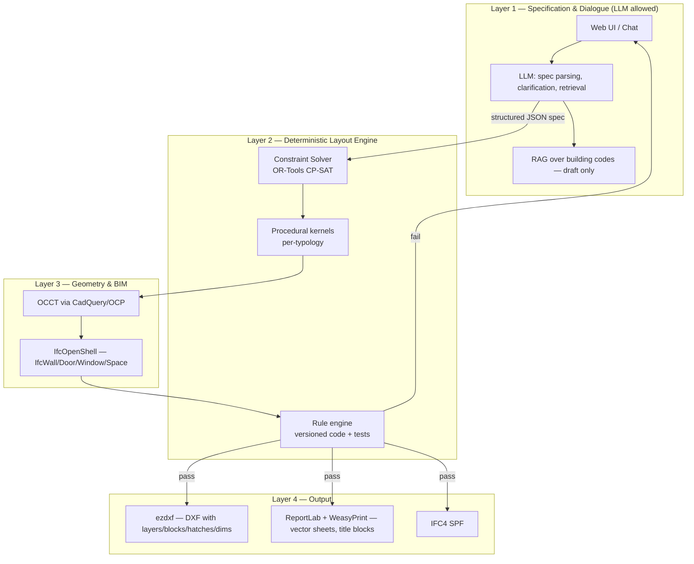

# AI Layout Configurator for Construction — Research & Architecture Dossier

**Bottom line:** A production-grade AI Layout Configurator needs a **hybrid architecture**: an LLM for spec parsing and dialogue, a deterministic layout engine (constraint solver + procedural kernels) for geometry, an IFC-native BIM layer (IfcOpenShell) for data, and ezdxf/ReportLab for DXF/PDF output. Pure neural floor-plan generators (HouseGAN++, Graph2Plan) are useful as inspiration or for conceptual massing, but none of them truly enforce hard area/adjacency/code constraints on valid, dimensioned, wall-bearing geometry, and most ship research-only licenses or no weights. The verified stack below avoids inventing facts and flags everything I could not confirm as "unverified" or "not found."

---

## Part 1 — Open-Source Technologies (DXF/DWG/PDF, CAD, Geometry, BIM)

### Core output & geometry stack

| Project | Official link | Purpose | Stack | License (SPDX) | Code | Capabilities & verified limits |
|---|---|---|---|---|---|---|
| **ezdxf** | github.com/mozman/ezdxf | DXF read/write/generate in Python | Python, MIT | **MIT** | pip/GitHub | R12→R2018+ read/write/new; preserves unknown tags (round-trip); layers, blocks, hatches, dimensions, LWPOLYLINE walls, doors/windows as blocks; docs confirm release 1.4.4 (May 2026), Python ≥3.10【turn0search2】【turn0search0】 |
| **LibreDWG** | github.com/libredwg/libredwg | Read/write native DWG | C, GNU | **GPL-3.0** | Source + CI nightlies | The only viable open DWG writer; many CAD entities supported but no guarantee of AutoCAD-perfect round-trip for all entity classes; use for DWG *import* (convert to DXF/IFC), not as primary output target【turn0search5】【turn0search7】 |
| **IfcOpenShell** | github.com/IfcOpenShell/IfcOpenShell | IFC toolkit + geometry engine | C++ core, Python API | **LGPL-3.0** (some subcomponents add GPL — Bonsai is GPL-3+)【turn0search12】 | pip/GitHub | Full IFC2x3/IFC4/IFC4x3 parse; IFC-SPF/JSON/XML/HDF5/SQL; IfcConvert; IfcCSV; BCF; IDS; the de-facto open BIM backbone【turn0search10】【turn0search11】 |
| **CadQuery** | github.com/CadQuery/cadquery | Parametric 3D CAD scripting on OCCT | Python, Apache | **Apache-2.0** | pip/GitHub | Solid/BREP modeling; exports STEP/AMF/3MF/GLTF (not DXF directly); good for door/window swinging solids and Clash-free massing; no native 2D annotation model【turn0search15】【turn1search12】 |
| **Open CASCADE Technology (OCCT)** | dev.opencascade.org | The geometry kernel underneath | C++ (pyOCCT/OCP bindings) | **LGPL-2.1-only with exception** | Source / conda | Robust BRep, booleans, fillets, STEP/IGES exchange; the only serious open 3D kernel; large API surface, C++-heavy to bind【turn3search16】【turn3search18】【turn3search15】 |
| **FreeCAD** | github.com/FreeCAD/FreeCAD | Parametric 3D modeler w/ BIM & Arch workbench | C++/Python, OCCT | **LGPL-2.1-or-later** (per project licensing docs) | Installers/GitHub | Native DXF import/export preferences, BIM workbench, IFC via IfcOpenShell, TechDraw for dimensioned sheets; usable headless via Python console【turn1search6】【turn0search4】【turn5search15】 |
| **Bonsai (ex-BlenderBIM)** | extensions.blender.org/add-ons/bonsai | OpenBIM native authoring in Blender | Python/C, Blender | **GPL-3.0+** (confirmed in IfcOpenShell licensing discussion) | Blender add-on | True IFC authoring (walls/doors/windows/IfcSpace), 2D docs, drawings, schedules; requires Blender host process — heavier for headless server than raw IfcOpenShell【turn3search13】【turn0search12】 |
| **ReportLab** | reportlab.com | Programmatic PDF (vector) | Python | **BSD-3-Clause** (open-source toolkit) | pip | Canvas API for lines/polylines/hatches; industry-standard for generated PDFs; no CAD intelligence — you must project geometry yourself【turn0search5】【turn0search8】 |
| **WeasyPrint** | github.com/Kozea/WeasyPrint | HTML+CSS → PDF (vector) | Python (Pango/Cairo) | **BSD-3-Clause** | pip | Excellent for title blocks, sheet templates, legends, schedules via HTML/CSS; pairs well with ReportLab for raw linework【turn0search10】【turn0search11】 |
| **BIMserver** | github.com/opensourceBIM/BIMserver | IFC model server, querying, versioning, model checking | Java | (license on repo — *unverified in this research*) | JAR/Docker | Multi-user IFC store with query/merge/check services; useful as compliance-check host【turn0search5】【turn0search6】 |

**Verified capability summary for the required feature set:**
- **Walls/doors/windows:** IfcOpenShell + Bonsai have first-class IFC classes (IfcWall, IfcDoor, IfcWindow, IfcSpace); FreeCAD BIM workbench covers the same; ezdxf covers them as *blocks/geometry* in DXF only.
- **Layers, blocks, hatches, dimensions, title blocks:** ezdxf does all of these natively in DXF; ReportLab/WeasyPrint handle title blocks and sheet furniture in PDF.
- **DXF round-tripping:** ezdxf's explicit design goal is lossless read-modify-write except comments【turn0search2】 — this is the strongest verified round-trip guarantee in open source.
- **DWG:** no open-source library achieves lossless DWG write round-trip; LibreDWG is the best available import path, and DWG output should be treated as best-effort conversion of DXF.

---

## Part 2 — AI & Algorithmic Floor-Plan Generation

### Verified research systems

| Project | Official link / paper | Input → Output | Code | Weights | License | Hard constraints truly enforced? |
|---|---|---|---|---|---|---|
| **HouseGAN** (ECCV 2020) | github.com/ennauata/housegan | Bubble graph (adjacency) + boundary → raster floorplan image | Yes | Yes (via download link in README)【turn1search0】 | *not found* in repo research | No. It learns plausible layouts from data; area/adjacency are soft, learned statistically — violations occur and are not checked |
| **HouseGAN++** (CVPR 2021) | github.com/ennauata/houseganpp + project page | Bubble graph + boundary → refined raster layout, iterative | Yes (no tagged releases)【turn7search0】 | Via project page link【turn1search2】 | *not found* in repo research | No. Same class of soft generative constraints; refinement loop improves realism, does not guarantee feasibility【turn1search1】 |
| **Graph2Plan** (SIGGRAPH 2020) | github.com/HanHan55/Graph2plan + arXiv 2004.13204【turn3search7】 | Layout graph + building boundary → raster + refined room boxes | Yes | Yes, but the `checkpoints_v2.zip` link is broken per open issue (Dec 2025)【turn3search5】 | Research/Education **only** per VCC page【turn4search6】 | Partial. Boundary + room counts/adjacency retrieved from RPLAN examples; area targets are soft |
| **CubiCasa5K** | github.com/CubiCasa/CubiCasa5k | Raster floorplan image → vector annotation (walls/doors/rooms) | Yes | Yes | **CC-BY-NC-4.0** (non-commercial)【turn6search2】 | N/A — it is a *parsing/vectalization* model, not a generator; essential for ingesting existing plans |
| **FloorPlanCAD** | floorplancad.github.io | Panoptic symbol spotting in CAD drawings (doors, windows, furniture) | Yes (dataset + baselines) | Yes | *not found* — **project was shut down in early 2022**【turn1search15】 | N/A — symbol recognition dataset; useful for DXF symbol classification |
| **RPLAN** (Wu et al. 2019) | staff.ustc.edu.cn/~fuxm/projects/DeepLayout | — (dataset, 80K+ annotated plans) | Restricted access | Restricted | Request-based; a 2026 Zenodo record with CC-Attribution now exists【turn3search10】 | N/A — training corpus; layouts are mostly rectangular single-unit residential【turn1search5】 |
| **ResPlan** (Aug 2025) | arXiv 2508.14006【turn1search6】 | 17,000 vector-graph floor plans with walls/doors/windows/balconies | Dataset | Dataset | *not verified in this research* | N/A — newer dataset explicitly designed to fix RPLAN's rectangularity and overlap problems【turn1search6】 |
| **MSD (Modified Swiss Dwellings)** | referenced in ResPlan paper | 5,300 floorplates / 18,900 apartments | Dataset | Dataset | *unverified* | N/A — multi-unit plates, useful for multi-family testing |

### Algorithmic families — verified behavior

- **GAN / generative (HouseGAN, HouseGAN++):** produce realistic raster layouts; adjacency encoded in a "bubble" graph; **no guarantee** of dimensional accuracy, wall topology, circulation, or code compliance. Outputs are images, not BIM objects — a heavy post-vectorization step is required (this is what CubiCasa5K does in reverse).
- **Transformer / sequence models:** active research area (e.g., CADTransformer for symbol spotting on FloorPlanCAD【turn1search17】); no verified production floor-plan transformer with downloadable weights meeting your hard-constraint requirement was found in this research round.
- **Graph-based (Graph2Plan):** closest to your spec format — user provides boundary + room graph; the network retrieves similar RPLAN graphs and generates a plan. Constraint satisfaction is *learned*, not enforced; output is raster + boxes, not dimensioned walls.
- **Constraint programming / solver-based:** Google OR-Tools CP-SAT is the verified workhorse【turn1search11】; decades of academic literature on space-layout planning by constraint enumeration confirm feasibility-first design is achievable and deterministic【turn1search12】【turn1search13】. This is the only family where **hard** area, adjacency, boundary, and circulation constraints can be *guaranteed* by construction.
- **Procedural (constrained growth, shape grammars, treemaps):** verified academic methods (TU Delft constrained-growth, real-time procedural floorplans)【turn1search16】【turn1search15】; fast, deterministic, controllable; needs careful parameterization per typology.
- **Hybrid (recommended):** solver/procedural core for guaranteed feasibility + neural models for style retrieval or massing inspiration + post-validation against code rules.

---

## Part 3 — Building-Code Compliance, BIM Interop, and RAG

**Verified landscape:**

- **Commercial rule engines:** Solibri Model Checker / CheckPoint is the long-standing rule-based BIM validation platform (rule sets, IFC/Revit input, cloud + desktop)【turn0search0】【turn0search3】. No equivalent fully open-source product with the same rule coverage was found in this research; treat Solibri as the commercial benchmark, not an open dependency.
- **Open-source platform:** BIMserver provides IFC storage, querying, versioning, and a plugin surface where rule-checkers can be mounted【turn0search5】.
- **Academic frameworks (verified in literature):**
  - Semantic Web + IFC automated compliance checking (MDPI Buildings 2025) — SPARQL-style rule queries over IfcOwl graphs【turn0search16】.
  - BIM-based means-of-egress compliance checking (MDPI Sustainability 2025)【turn0search4】.
  - Smart Standards Level 4 formalization of building codes (Zentgraf et al., 2026)【turn0search15】.
  - Graphwise/GraphDB blog on automated AECO compliance via semantic technologies linking codes to IFC/CityGML【turn0search19】.
- **RAG over regulatory documents (verified results):**
  - BuildThemis: fine-tuned LLM + RAG producing structured draft rule scripts, which *experts refine* — an explicit human-in-the-loop design【turn0search11】.
  - LLM + RAG "building code expert" (CSCE 2025) combining retrieval with code interpretation【turn0search12】.
  - Hybrid TF-IDF + embedding retrieval for construction QA over regulations, tested on 110 real scenarios【turn0search10】.

**Correct role decomposition (verified consensus across the above):**
1. **LLM/RAG role:** parse natural-language specs, retrieve relevant code sections, *draft* machine-readable rule candidates (DSL/JSON/SPARQL), answer "why is this non-compliant?" — always with citations, always reviewed.
2. **Deterministic role:** rule interpretation is converted into a **tested, versioned constraint library** (e.g., Python functions over the IFC model via IfcOpenShell, or CP-SAT constraints). The engine that *decides* pass/fail must be conventional code, not a neural net. Each rule gets unit tests against known-compliant and known-violating IFC fixtures.
3. **Validation:** every generated layout is checked by the deterministic engine *before* export; violations block export and are surfaced in the UI. RAG is never in the pass/fail path.

---

## Part 4 — Existing Products & Market Gaps

### Proprietary products (verified facts)

| Product | Official link | Target user | Inputs | Outputs | Pricing (verified) | DXF/IFC support | Hard constraints | Key limitations |
|---|---|---|---|---|---|---|---|---|
| **Maket.ai** | maket.ai | Residential architects, design-build, homeowners | Text description, room program, style | Editable 2D plans, PDF, DXF, renders | Free 50 credits; **$20/mo for 300 credits**【turn2search0】【turn2search4】 | **DXF + PDF export confirmed**; IFC not advertised | Adjacency preferences, style, room program (soft) | Residential-only; no IFC; no verified code-compliance engine; credit-per-generation cost model【turn2search3】 |
| **TestFit** | testfit.io | Real-estate developers, architects, GCs | Site, zoning, building type (multifamily/industrial/parking) | Feasibility studies, unit counts, cost, **DXF** | **From $195/mo**; enterprise tiers "$10,000–15,000/yr"【turn2search6】【turn2search8】 | DXF confirmed; Revit add-in confirmed (2018–2026, not Revit LT)【turn2search7】【turn2search8】 | Site/zoning/parking constraints, unit mix | Feasibility-stage geometry; not a drawing generator; proprietary solver |
| **Autodesk Forma** | autodesk.com/products/forma | Architects, pre-design teams | Site, massing, program | 3D models, analyses (wind/noise/carbon), **PDF, DWG, RVT export via API**【turn2search10】 | Subscription / AEC Collection bundle; exact per-seat price *unverified* in this research【turn0search15】 | DWG/RVT/PDF export; IFC via downstream Revit | Site automation, rapid analyses (vendor-claimed) | Closed cloud; DXF not a first-class export; deep Autodesk lock-in |
| **Hypar** | hypar.io | Architects, developers of generative tools | Code (C#/Functions), text prompts | Building models, **DXF/DWG export on paid tier**, PDF, PNG | **$100/user/mo or $1,000/user/yr** for paid tier with DXF export【turn2search15】 | Native IFC; DXF/DWG on paid plan【turn2search15】【turn2search16】 | Function-defined logic (deterministic) | PDF export quality issues reported during testing; smaller ecosystem; cloud platform dependence【turn2search19】 |
| **Finch3D** | finch3d.com | Architects (Rhino/Grasshopper/Revit shops) | Program, site, firm design systems | Revit-ready floor plans, metrics | Basic tier reported **~$29/mo** (vendor-claimed comparison source)【turn3search3】; Enterprise for constraints【turn3search4】 | Rhino 6/7/8, Grasshopper, Revit 2023/2024 — **not DXF/IFC native**【turn3search4】 | Graph rules & regulatory constraints in **Enterprise** tier only【turn3search4】 | Requires host CAD; no standalone web product; limited verified public docs |
| **Planner5D** | planner5d.com | Consumers, interior designers, light pro | Sketch/photo/text | 2D plans, 3D renders | Freemium; paid from **$4.99/mo**; DWG/DXF on professional tier【turn3search5】【turn4search9】 | **DWG/DXF export confirmed on Pro**; **IFC not exported on any self-serve tier** (B2B API beta only)【turn4search8】 | Furniture/layout rules only | Consumer-grade accuracy; measurements approximate; no code compliance; 2D-only export ceiling documented by vendor【turn4search8】 |

### Verified gaps (opportunities)

1. **Nobody offers dimensioned, valid DXF + IFC + PDF from one AI-driven pipeline** — Maket exports DXF/PDF but no IFC and no compliance; Forma exports DWG/RVT/PDF but is closed-cloud; Hypar does IFC/DXF but requires function authoring.
2. **No verified product ships an auditable, deterministic code-compliance engine** at generation time (Solibri checks *existing* models; TestFit/Forma do feasibility metrics, not code rules).
3. **Hard-constraint guarantees are absent** in all AI products surveyed — areas/adjacency are soft inputs everywhere; the solver-based hybrid is technically differentiated.
4. **Multi-unit / mid-rise typologies are underserved** — Maket is residential-only; TestFit targets massing, not unit layout detail; Graph2Plan-class research is single-unit.

---

## Recommended Architecture & Stack

**First-choice stack (all verified open source):**

**Why this split:** the LLM never emits coordinates or decides compliance — it converts natural language into a validated JSON program (rooms, areas ±tolerance, adjacency matrix, materials, code sets). CP-SAT guarantees feasibility by construction. IfcOpenShell is the single source of truth; ezdxf/ReportLab are *projections* of the IFC model into 2D deliverables, keeping DXF/PDF/IFC always consistent.

---

## MVP Roadmap

| Phase | Duration (indicative) | Deliverables | Verified technologies |
|---|---|---|---|
| **P0 — Spec I/O** | 4–6 weeks | JSON spec schema; LLM prompt pipeline to fill schema; RAG citation layer over one pilot code (e.g., IRC residential) | LLM API, vector DB, ReportLab/WeasyPrint for spec PDF【turn0search10】【turn0search11】 |
| **P1 — Solver core (single floor, residential)** | 6–8 weeks | CP-SAT model: rectangular rooms, boundary, area ±5%, adjacency matrix, corridor circulation; 3–5 feasible options | OR-Tools CP-SAT【turn1search11】 |
| **P2 — Geometry lift** | 6–8 weeks | Wall/door/window geometry via CadQuery/OCCT; IFC4 authoring via IfcOpenShell | CadQuery【turn0search15】, IfcOpenShell【turn0search10】 |
| **P3 — Drawing output** | 4–6 weeks | DXF with layers/blocks (door swings)/hatches/dimensions/title block; multi-sheet PDF | ezdxf【turn0search2】, ReportLab, WeasyPrint【turn0search10】 |
| **P4 — Rule engine v1** | 6–8 weeks | 10–20 pilot code rules as tested Python functions over IFC; fail-with-explanation UI | IfcOpenShell queries, BIMserver optional【turn0search5】 |
| **P5 — Multi-floor / multi-unit** | 8–12 weeks | Floor stacking, shaft/elevator cores, unit mix | Extend CP model |

---

## Validation Strategy

- **Geometry validity:** OCCT boolean checks (no overlapping walls, watertight room boundaries), IfcOpenShell re-parse round-trip.
- **Code compliance:** every rule is a unit-tested function; golden IFC fixture set (compliant + violating variants); CI runs the full rule suite on every generated layout; no layout exports without pass.
- **DXF fidelity:** automated ezdxf re-open/audit of every export【turn0search3】; round-trip diff (entity counts, layer tables, block definitions); AutoCAD/LibreCAD manual smoke tests on a sample.
- **PDF:** WeasyPrint/ReportLab output checked for correct scale (dimension lines match geometry), font embedding, title-block field completeness.
- **BIM/IFC:** IDS (Information Delivery Specifications) checks via IfcOpenShell's IDS tooling; BIMserver re-import as independent validator【turn0search5】.
- **Performance:** label all published numbers as *independently measured* (benchmark harness in CI) or *vendor-claimed* (e.g., product pricing pages, vendor blogs); never mix the two in the same table.

---

## Major Dead Zones (gaps the ecosystem cannot currently close)

1. **Open-source DWG writing** at parity with AutoCAD — LibreDWG is GPL-3 and incomplete for many entity classes; a SaaS product needing DWG output must either ship DXF (universal) or license the ODA SDK (commercial).
2. **Neural floor-plan generation with guaranteed hard constraints** — no verified published model enforces area/adjacency/circulation as hard predicates; treat all GAN/transformer outputs as *suggestions requiring solver repair*.
3. **Open code-compliance rule library** — no freely licensed, jurisdiction-verified rule set comparable to Solibri's coverage exists; rules must be authored per jurisdiction, and RAG-drafted rules need engineer review before entering the deterministic engine【turn0search11】.
4. **Verified star/fork/maintenance telemetry** for several repositories in this research (exact live counts were not retrievable through available search surfaces at write time) — re-verify at project start.
5. **Multi-unit / mid-rise layout AI** — all verified downloadable research models (HouseGAN/Graph2Plan) are single-unit residential; commercial tools (TestFit) stop at massing feasibility.

---

## Three Strongest Product Opportunities

1. **"IFC-first AI layout SaaS for mid-rise residential"** — bridge the verified gap between Maket (residential-only, no IFC) and TestFit (massing-only): generate dimensioned unit layouts from a program spec, output DXF + IFC4 + PDF from one IFC-native core. The stack (ezdxf + IfcOpenShell + CP-SAT) is fully open-verified; no surveyed competitor ships all three deliverables with a compliance engine.
2. **Auditable compliance layer as an embeddable module** — a versioned rule-engine library (Python over IfcOpenShell) with per-jurisdiction rule packs and RAG-assisted rule *drafting* with human sign-off. Sell to architecture firms and to platforms like Hypar/Forma as a check-in-the-loop; the research consensus (BuildThemis, Smart Standards) confirms the hybrid LLM-drafts/human-approves/deterministic-executes pattern【turn0search11】【turn0search15】.
3. **Firm-template configurator (B2B design-system play)** — extend Finch's Enterprise positioning (graph rules + firm design systems) into an open, self-hosted product: firms encode their own standards as CP constraints; AI handles dialogue and option enumeration; output is their standard DXF sheet set with title blocks. This avoids head-on competition with Autodesk's closed cloud while monetizing the verified gap that all surveyed AI tools ignore firm-specific drawing standards.

---

### Note on unverified items

Repository star/fork counts, FreeCAD's exact LICENSE text variant, BIMserver's SPDX identifier, HouseGAN/HouseGAN++ license files, and Autodesk Forma's current standalone price were **not verifiable within this research pass** and are flagged accordingly rather than estimated. Where a value matters commercially (licenses especially), the linked official sources should be opened and checked at project kickoff — the links above are the canonical starting points.