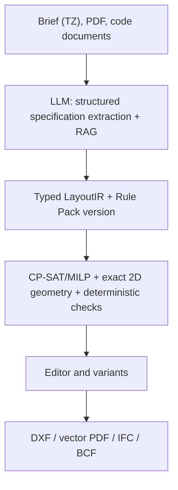

# Summary

For a production **AI Layout Configurator** I recommend a **solver-first hybrid** architecture:



The LLM may parse the brief (TZ), explain variants and propose changes. It must not on its own determine final coordinates, "confirm" code compliance or write DXF/IFC directly.

Verification was done against official repositories, documentation, product pages and primary publications. Snapshot: **28.08.2026 UTC**. GitHub stars and forks are a dynamic snapshot; where GitHub did not show the last commit date, `not found` is given rather than an assumed date. Metrics:

* `[A]` — measurement by the paper/repository authors;
* `[V]` — vendor claim;
* `[I]` — independent measurement. No independent benchmarks were found for commercial products.

Main conclusion: no verified product or research project simultaneously demonstrates an arbitrary brief, multi-storey support, exact areas, building codes, editable DXF, vector PDF, full IFC and a proven round-trip.

---

## 1. Open-source technologies

### 1.1. Core projects

| Project                                                                                                                 | Purpose and stack                                                                                                                                     | License / SPDX                                                                         | GitHub snapshot                                                                                  | Artifacts, performance and limitations                                                                                                                                                                                                                                                                                                                                         |
| ---------------------------------------------------------------------------------------------------------------------- | ----------------------------------------------------------------------------------------------------------------------------------------------------- | --------------------------------------------------------------------------------------- | ---------------------------------------------------------------------------------------------- | ----------------------------------------------------------------------------------------------------------------------------------------------------------------------------------------------------------------------------------------------------------------------------------------------------------------------------------------------------------------------------------- |
| [ezdxf](https://github.com/mozman/ezdxf), [docs](https://ezdxf.readthedocs.io/)                                        | Python library for reading/creating/modifying DXF; R12–R2018, modelspace/paperspace/block, layers, linetypes, text styles, HATCH, DIMENSION, blocks | MIT                                                                                     | Stars: not displayed; forks: 268; commits: 9,181; last commit: not found                    | PyPI/wheels, source. Add-ons allow SVG/PDF/PNG output. Excellent DXF writer, but no semantic `Wall/Door/Window`: these must be built as lines, polylines, blocks and XDATA. Round-trip preserves many unknown tags, but this does not guarantee semantic compatibility with AutoCAD/Revit. Performance: official capabilities; no independent benchmark found. |
| [LibreDWG](https://github.com/libredwg/libredwg)                                                                       | C library for DWG/DXF; `dwg2dxf`, `dxf2dwg`, SVG/PS utilities                                                                                          | GPL-3.0-or-later                                                                        | Stars: 1.6k; forks: 347; commits: 7,968; last commit: not found                               | Source/nightly. README claims approximately 90% DWG→DXF and 80% DXF→DWG `[A: maintainer claim]`; writing R2010–R2018 still has limitations/CRC problems. Do not use as the sole production DWG round-trip without a large test corpus.                                                                                                                          |
| [FreeCAD](https://github.com/FreeCAD/FreeCAD), [downloads](https://www.freecad.org/downloads.php?lang=en)              | Parametric CAD, Python/C++, Qt, Coin3D, Open CASCADE; Sketcher, TechDraw, Architecture/BIM workbenches                                           | LGPL-2.1-only per repository contents; upstream does not state a separate SPDX string     | Stars: not displayed; forks: about 6k; commits: 48,279; last visible commit: 28.08.2026 | Official Windows/macOS/Linux installers; `FreeCADCmd` for headless. Can create architectural elements via workbenches, TechDraw, dimensions, sheet templates. Good as a 3D/2D QA and authoring bridge, but not a ready code-compliance engine and not a simple server-side core.                                                                                                        |
| [Open CASCADE Technology](https://github.com/Open-Cascade-SAS/OCCT), [official site](https://dev.opencascade.org/)     | C++ B-rep/NURBS/solid geometry kernel, CAD exchange, visualization                                                                                    | LGPL-2.1-only + special OCCT exception; exact compound SPDX expression not found | Stars: 2.8k; forks: 663; commits: 7,159; last commit: not found                               | Source and official releases. Good for robust 3D geometry, but contains no BIM semantics, building rules or DXF/PDF drawing system.                                                                                                                                                                                                                                          |
| [CadQuery](https://github.com/CadQuery/cadquery)                                                                       | Python parametric CAD on top of OCCT; headless, STEP/DXF/STL/3MF/VRML export                                                                        | Apache-2.0                                                                              | Stars: not displayed; forks: 531; commits: 2,229; last commit: not found                    | pip/conda/pixi, Docker/Apptainer, wheels. Convenient for parametric walls and volumes, but IFC semantics, dimension styles, title blocks and full architectural drawings require custom code.                                                                                                                                                                                |
| [IfcOpenShell](https://github.com/IfcOpenShell/IfcOpenShell), [docs](https://docs.ifcopenshell.org/)                   | C++/Python IFC parser, geometry engine, IFC authoring/conversion; IFC2x3, IFC4, IFC4.3                                                                | Main part: LGPL-3.0-or-later; individual components have their own licenses      | Stars: 2.7k; forks: 954; commits: 22,582; exact last commit date not confirmed       | Source, Python packages, `IfcConvert`, `ifctester`, `ifcclash`, `ifcpatch`. Best candidate for IFC export/validation in a Python stack. IFC is a BIM model, not a 2D CAD sheet and not a DXF/PDF writer.                                                                                                                                                                                     |
| [Bonsai](https://bonsaibim.org/), [repo](https://github.com/IfcOpenShell/IfcOpenShell)                                 | Former BlenderBIM; Blender add-on for IFC authoring/editing/QA                                                                                        | GPL-3.0-or-later                                                                        | No separate statistics; part of the IfcOpenShell monorepo                                       | Requires Blender; official requirements specify Blender 4.3–4.5 and Python 3.11. Good for interactive IFC inspection and demos, but not the best headless production dependency.                                                                                                                                                                                                  |
| [Shapely](https://github.com/shapely/shapely)                                                                          | Python API over GEOS: polygon boolean, buffer, union/intersection, containment, spatial predicates                                                     | BSD-3-Clause                                                                            | Stars: 4.5k; forks: 631; commits: 2,496; last commit: not found                               | PyPI. Basic 2D geometry validator for LayoutIR. Does not create DXF/PDF/IFC and has no notion of walls/doors as BIM entities.                                                                                                                                                                                                                                                               |
| [CGAL](https://www.cgal.org/), [Boolean operations](https://doc.cgal.org/latest/Boolean_set_operations_2/index.html)   | C++ exact computational geometry, polygon/polyhedron boolean operations                                                                               | GPL-3.0-or-later OR commercial; dual licensing                                          | Stars/forks/last commit: not found in verified sources                                   | Source. Useful for especially strict predicates and complex polygons; the commercial license requires separate review.                                                                                                                                                                                                                                                              |
| [OR-Tools](https://github.com/google/or-tools)                                                                         | C++/Python/C#/Java; CP-SAT, linear/MIP, routing, graph algorithms                                                                                     | Apache-2.0                                                                              | Stars: 14.0k; forks: 2.5k; commits: 15,819; last commit: not found                            | pip, NuGet, Maven, source/binaries. Best candidate for room packing, non-overlap, area ranges, adjacency, boundary, objectives. Not a geometry kernel — Shapely/custom geometry is needed.                                                                                                                                                                                       |
| [Z3](https://github.com/Z3Prover/z3)                                                                                   | SMT theorem prover; Boolean/integer/real logic, Python/C++/.NET/Java/JS bindings                                                                      | MIT                                                                                     | Stars: 12.6k; forks: 1.7k; commits: 22,829; last commit: not found                            | Binaries and bindings. Good for logical rules, conflicts and applicability conditions. Does not replace a spatial solver.                                                                                                                                                                                                                                                                    |
| [ReportLab](https://docs.reportlab.com/reportlab/userguide/ch2_graphics/), [PyPI](https://pypi.org/project/reportlab/) | Python PDF generation; paths, lines, arcs, Bézier, text, vector graphics                                                                              | BSD; exact BSD SPDX variant not found in the official source                          | GitHub stars/forks/last commit: not found                                                     | pip/PyPI. Suitable for vector PDF, dimensions, title blocks, legends and hatches, but all of these must be modelled yourself. No DXF round-trip.                                                                                                                                                                                                                           |
| [WeasyPrint](https://github.com/Kozea/WeasyPrint), [docs](https://doc.courtbouillon.org/weasyprint/stable/)            | HTML/CSS → PDF; SVG stays vector in PDF                                                                                                          | BSD-3-Clause                                                                            | Stars: 9,534; forks: 862; commits: 6,602; last pushed: 25.08.2026                              | pip. Good for sheets, reports, title blocks, legends and SVG geometry. Not a CAD model, no DXF semantics.                                                                                                                                                                                                                                                                             |
| [CairoSVG](https://github.com/Kozea/CairoSVG), [site](https://cairosvg.org/)                                           | SVG → PDF/PS/PNG/SVG via Cairo                                                                                                                      | LGPL-3.0; exact SPDX suffix not shown                                                 | Stars: 949; forks: 167; commits: 1,025; last commit: not found                                | pip/CLI. Good final stage for `LayoutIR → SVG → vector PDF`; does not support DXF round-trip.                                                                                                                                                                                                                                                                                      |
| [xBIM Essentials](https://github.com/xBimTeam/XbimEssentials), [docs](https://docs.xbim.net/)                          | .NET IFC/STEP/IfcXML/IfcZIP toolkit, geometry, validation, BCF/COBie                                                                                  | CDDL-1.0                                                                                | Stars/forks/last commit: not found on the verified page                                     | NuGet/source. Strong alternative to IfcOpenShell for .NET. [xBim.IDS.Validator](https://github.com/xBimTeam/Xbim.IDS.Validator) is licensed AGPL-3.0-only and therefore requires a separate license analysis.                                                                                                                                                                        |
| [BIMserver](https://github.com/opensourceBIM/bimserver), [site](https://bimserver.org/)                                | Java IFC server, model versioning, merging, project structures, model checking                                                                        | AGPL-3.0-only; plugins may have other licenses                                      | Stars: 1.7k; forks: 645; last commit: not found                                               | Source. Useful as a CDE/model repository, but not needed for the generator MVP.                                                                                                                                                                                                                                                                                                        |

### 1.2. DWG and headless rendering

[ODA File Converter](https://www.opendesign.com/guestfiles/oda_file_converter) — proprietary bridge for DWG/DXF conversion with GUI and CLI. The official page offers Windows/Linux/macOS packages and a trial; no SPDX license. It is a reasonable optional DWG adapter, but it must not be made a mandatory dependency of an open deployment.

For a headless pipeline:

* [FreeCADCmd](https://wiki.freecad.org/Headless_FreeCAD) — headless FreeCAD;
* [Blender background rendering](https://docs.blender.org/manual/en/latest/advanced/command_line/render.html) — `--background`, no GUI/display;
* [`IfcConvert`](https://docs.ifcopenshell.org/ifcconvert.html) — IFC→SVG, GLB, OBJ, STEP, IGES and other formats;
* custom SVG→[CairoSVG](https://cairosvg.org/) or [WeasyPrint](https://weasyprint.org/) — predictable vector PDF.

### 1.3. Capability matrix

`✓` — built-in/semantic; `△` — possible with primitives or custom code; `—` — not the purpose of the project.

| Technology              |           Walls | Doors/windows |                          Layers |             Blocks | Hatches/dimensions | Title block |          Vector PDF |                                    DXF round-trip |
| ----------------------- | --------------: | ------------: | ------------------------------: | -----------------: | -----------------: | ----------: | ------------------: | ------------------------------------------------: |
| ezdxf                   |               △ |             △ |                               ✓ |                  ✓ |                  ✓ |           △ |                   △ |                                                 △ |
| LibreDWG                |               △ |             △ |                               △ |                  △ |                  △ |           △ |  limited SVG/PS     |                           △, version-dependent    |
| FreeCAD TechDraw/Draft  |             ✓/△ |           ✓/△ |                               △ |                  △ |                  ✓ |           ✓ |                   ✓ |                                                 △ |
| CadQuery                |    △, via solids |             △ |                               △ |                  △ |                  △ |           △ |                   — |                                                 △ |
| IfcOpenShell/Bonsai     |           ✓ BIM |         ✓ BIM | IFC presentation, not CAD layers |                  — |           —/custom |    —/custom |                   — |                                        —/external |
| ReportLab               |      △, drawing |             △ |                               — | reusable functions |                  △ |           △ |                   ✓ |                                                 — |
| SVG/CairoSVG/WeasyPrint |        △, paths |    △, symbols |                      SVG groups |    reusable groups |                  △ |           △ |                   ✓ |                                                 — |
| ODA File Converter      |               △ |             △ |                               ✓ |                  ✓ |                  ✓ |           △ |                   — | best of the verified DWG bridges, but proprietary |

Critical distinction: **DXF is a drawing exchange format, while IFC is a semantic BIM model**. A DXF export must not be treated as proof of the presence of `IfcWall`, `IfcDoor`, materials, spatial structure or a correct BIM round-trip.

---

## 2. AI and algorithmic layout generation

### 2.1. Public code and datasets

| Project                                                                                                                      | Input → output; actual constraints                                                                                                                           | License                                                                                                               | GitHub snapshot                                                                                       | Artifacts / performance / limitations                                                                                                                                                                                                                                                                          |
| --------------------------------------------------------------------------------------------------------------------------- | ------------------------------------------------------------------------------------------------------------------------------------------------------------ | --------------------------------------------------------------------------------------------------------------------- | --------------------------------------------------------------------------------------------------- | -------------------------------------------------------------------------------------------------------------------------------------------------------------------------------------------------------------------------------------------------------------------------------------------------------------- |
| [HouseGAN](https://github.com/ennauata/housegan)                                                                            | Bubble/layout graph → axis-aligned room boxes/segmentation. Graph adjacency is used as a condition, but exact areas, circulation and code are not guaranteed | GPL v3 + additional “research purposes only”; not a clean SPDX; effectively `GPL-3.0-only + additional restriction` | 293 stars; 77 forks; 44 commits; last commit: not found                                            | Code, pretrained model and LIFULL subset available via the repo. Metrics — `[A]`; output is not CAD/BIM, not DXF.                                                                                                                                                                                                        |
| [HouseGAN++](https://github.com/ennauata/houseganpp)                                                                        | RPLAN/bubble graph → room segmentation/vector-like layout; graph constraints and iterative refinement                                                          | GPL v3 + research-only restriction                                                                                    | 254 stars; 48 forks; 5 commits; last commit: not found                                             | Code/checkpoints/data links in the repo. No proven hard area/circulation/code constraints; output is not DXF/IFC.                                                                                                                                                                                                  |
| [Graph2Plan](https://github.com/HanHan55/Graph2plan), [paper](https://arxiv.org/abs/2004.13204)                             | Layout graph + building boundary → raster plan + refined room boxes; boundary and graph are part of the pipeline                                                      | License file not found; `unverified`                                                                                 | 346 stars; 83 forks; 27 commits; last commit: not found                                            | Code/web demo/RPLAN processing. Boundary/graph enforced at model interface, but no mathematical guarantee is proven; Windows/old Python/MATLAB dependencies.                                                                                                                                                 |
| [CubiCasa5K](https://github.com/CubiCasa/CubiCasa5k)                                                                        | Raster plan → segmentation, heatmaps, polygons; 5,000 images, 80+ object categories                                                                          | Dataset/model license not found in the verified official repo                                                          | 568 stars; 156 forks; last commit: not found                                                       | Dataset via Zenodo, pretrained weights via Google Drive. This is recognition/vectorization, not a conditional generator.                                                                                                                                                                                          |
| [FloorPlanCAD](https://floorplancad.github.io/)                                                                             | Architectural symbol spotting/panoptic annotations, SVG/PNG/COCO; not a generator                                                                               | Annotation site: CC-BY-NC-4.0; code license not found                                                                | Repo code marked as no longer maintained; stats/last commit: not found                           | Useful for parsing, but code/data provenance limits commercial training.                                                                                                                                                                                                                                  |
| [Tell2Design](https://github.com/LengSicong/Tell2Design), [paper](https://arxiv.org/abs/2311.15941)                         | Natural language describing room semantics, geometry and topology → room-box sequence/JSON                                                                   | Code Apache-2.0; dataset CC-BY-NC-4.0                                                                                 | 85 stars; 10 forks; last commit: not found                                                         | Code, data links, PyTorch/T5-like baseline. Paper reports micro IoU 54.34 and macro IoU 53.30 `[A]`; this is a research metric, not construction accuracy.                                                                                                                                                            |
| [HouseDiffusion](https://github.com/aminshabani/house_diffusion), [paper](https://arxiv.org/abs/2211.13287)                 | Bubble graph → vector polygon loops for rooms/doors; supports non-Manhattan shapes and corner counts                                                         | GPL-3.0; exact SPDX suffix not shown                                                                                 | 235 stars; 54 forks; 3 commits; last commit: not found                                             | Code/checkpoint links. The repo explicitly warns that it is incomplete. No exact area/material/code validation; output not DXF/IFC.                                                                                                                                                                                |
| [GSDiff](https://github.com/SizheHu/GSDiff), [paper](https://arxiv.org/abs/2408.16258)                                      | Diffusion + Transformer: graph of wall junctions/segments → room polygons/vector structural graph                                                            | GPL-3.0; exact variant not shown                                                                                     | 32 stars; 8 forks; 130 commits; last commit: not found                                             | Weights links; RPLAN processing; RPLAN-derived data redistribution restricted. “Surpasses SOTA” — `[A]`, no independent replication found.                                                                                                                                                                     |
| [ChatAssistDesign](https://github.com/l1060230026/layout)                                                                   | Language edits → iterative vector floorplan diffusion based on HouseDiffusion                                                                                | GPL v3 + research/commercial restriction                                                                              | 0 stars; 1 fork; 1 commit; last commit: not found                                                  | Code/weights advertised but repo says unclean and some features may not work. No code constraints.                                                                                                                                                                                                             |
| [DStruct2Design / DS2D](https://github.com/plstory/ds2d), [paper](https://arxiv.org/abs/2407.15723)                         | Structured JSON constraints → structured layout JSON; RPLAN and ProcTHOR; Llama3-8B LoRA                                                                     | Apache-2.0                                                                                                            | 32 stars; 5 forks; 15 commits; last commit: not found                                              | Code, converted ProcTHOR, Google Drive pretrained LoRA. Supports partial/complete numerical constraints at benchmark level, not building codes or IFC.                                                                                                                                                         |
| [floor-plan-rlvr](https://github.com/ludolara/floor-plan-rlvr)                                                              | JSON input: room count, total area, room constraints, bubble graph → JSON with room polygons, doors, areas, coordinates; SFT + RLVR + vLLM                   | License not found; `unverified`                                                                                      | 5 stars; 0 forks; 70 commits; last commit: not found                                               | Code and Hugging Face checkpoints: [SFT](https://huggingface.co/ludolara/fp5-sft-Llama3.3-70B), [RLVR](https://huggingface.co/ludolara/fp5-rlvr-Llama3.3-70B). Rewards verify JSON, non-overlap, connectivity, total area. README metrics are `[A: maintainer/paper]`; no boundary/code/circulation guarantee. |
| [DiffPlanner](https://github.com/shidong-wang/DiffPlanner), [paper](https://arxiv.org/abs/2508.13738)                       | Conditional diffusion/Transformer; boundary, bubble graph and other conditions → vector plan                                                                 | Repo license not shown; paper arXiv license CC-BY-NC-ND-4.0                                                         | 7 stars; 2 forks; last commit: not found                                                           | Preprocessed RPLAN/temp weights advertised. “SOTA” — `[A]`; not independent.                                                                                                                                                                                                                                   |
| [CE2EPlan](https://github.com/shidong-wang/CE2EPlan), [paper](https://arxiv.org/abs/2602.20377)                             | Topology/geometry-enhanced diffusion, GATransformer, masked multi-condition → vector polygons                                                                | Repo license not shown; paper license only                                                                          | 2 stars; 0 forks; 4 commits; last commit: not found                                                | Weights via Google Drive; Python 3.9/PyTorch 2.0. No code/DXF/IFC; paper claims performance `[A]`.                                                                                                                                                                                                             |
| [MANSION](https://github.com/AgibotGeneral/MANSION), [paper](https://arxiv.org/abs/2603.11554)                              | Natural language → LLM-driven procedural multi-floor 3D scenes: room segmentation, walls, doors, windows, furniture, lighting, renders                       | Apache-2.0                                                                                                            | 32 stars; 3 forks; 2 commits; last commit: not shown                                               | Code, Python setup, AI2-THOR/Objaverse assets, MansionWorld dataset. Strong reference for LLM→intermediate representation→procedural solver and vertical alignment, but not an IFC/DXF/code checker.                                                                                                                |
| [MSD](https://github.com/caspervanengelenburg/msd), [dataset page](https://caspervanengelenburg.github.io/msd-eccv24-page/) | 5,372 complex floorplans, 18.9k apartments, image/geometry/graph, multi-unit buildings, orientation                                                          | Dataset page indicates CC-BY-SA-4.0; code license not found                                                          | 130 stars; 11 forks; 14 commits; last commit: not found                                            | Kaggle data, graph extraction code. Model code still marked “will be released soon”; existing methods degrade on this dataset.                                                                                                                                                                                 |
| [SYNBUILD-3D](https://github.com/kdmayer/SYNBUILD-3D), [dataset](https://purl.stanford.edu/kz908vb7844)                     | Synthetic 6.2M+ semantic LoD4 buildings, floorplan images and roof point clouds                                                                              | CC-BY-4.0                                                                                                             | 107 stars; 9 forks; 12 commits; last commit: not found                                             | Dataset/sample download. Generation pipeline code “will be added soon”; not a layout solver or BIM exporter.                                                                                                                                                                                                   |
| [MLStructFP](https://github.com/MLSTRUCT/MLStructFP)                                                                        | 954 large-scale floorplans; wall/slab polygons in JSON, metric coordinates, raster/vector consistency                                                        | Code MIT; dataset terms separately not clearly exposed                                                                | Stars: not shown; forks: 9; commits: 139; last commit: not found; repository archived 29.04.2026 | pip package; dataset via request form. Useful for recognition and wall geometry, not generation; archived.                                                                                                                                                                                                     |
| [AFPlan](https://github.com/cansik/architectural-floor-plan)                                                                | Java/Gradle image analysis: morphology, ML, convex hull, connected components → CSV/SVG room geometry                                                        | License not found; `unverified`                                                                                      | 399 stars; 87 forks; 428 commits; last commit: not found                                           | Source; no packaged installer. README says DXF/DWG output was planned, but converter license was not finalized. Prototype for scan/raster ingestion.                                                                                                                                                           |
| [CubiGraph5K](https://github.com/luyueheng/CubiGraph5K)                                                                     | CubiCasa SVG → graph; adjacency, door-connectivity and shortest room paths                                                                                   | License not found                                                                                                     | 42 stars; 5 forks; 14 commits; last commit: not found                                              | Code + `data.json`; useful graph extraction, not generator.                                                                                                                                                                                                                                                    |
| [Hypergraph](https://github.com/ramonweber/hypergraph)                                                                      | C#/.NET geometry/research library, hypergraph floorplans, Rhino/Grasshopper, environmental analysis                                                          | MIT                                                                                                                   | 90 stars; 14 forks; 54 commits; last commit: not found                                             | Source, Docker/API, Rhino samples. README reports `<2s`, `<3s`, `<0.1s` and ~10s environmental simulation `[A: self-measured]`; requires Rhino/Climate Studio for samples.                                                                                                                                     |
| [FloorSet](https://github.com/IntelLabs/FloorSet)                                                                           | VLSI rectilinear floorplanning dataset: area targets, connectivity, boundary/preplaced/cluster constraints                                                   | Code Apache-2.0; dataset CC-BY-4.0                                                                                    | 117 stars; 34 forks; last commit: not found                                                        | 2M synthetic layouts. Useful algorithmic inspiration only; not building architecture.                                                                                                                                                                                                                          |

### 2.2. Paper-only or not-yet-reproducible work

| Project / source                                                                                             | Method and constraints                                                                                         | License/artifacts/stats                                                                          | Conclusion                                                                                                                                                                                                                                                      |
| ------------------------------------------------------------------------------------------------------------ | ----------------------------------------------------------------------------------------------------------- | ------------------------------------------------------------------------------------------------ | ---------------------------------------------------------------------------------------------------------------------------------------------------------------------------------------------------------------------------------------------------------- |
| [RPLAN](http://staff.ustc.edu.cn/~fuxm/projects/DeepLayout/index.html)                                       | Residential floorplan dataset, about 80k plans; primarily raster/annotation-based                           | Official download requires request; license and current access: `unverified`                     | Benchmark foundation, but residential/single-floor bias and uncertain commercial rights.                                                                                                                                                                   |
| [ResPlan](https://arxiv.org/abs/2508.14006)                                                                  | 17,000 vector-graph residential plans; walls, doors, windows, rooms; metric-scale coordinates               | Paper states CC-BY-4.0 for data; exact code/data repository and GitHub stats not found           | One of the best candidates for licensed vector pretraining; still residential and not code-aware.                                                                                                                                                          |
| [FML/FMLM](https://arxiv.org/abs/2604.04859), [project](https://mapooon.github.io/FMLPage/)                  | Floorplan Markup Language; Transformer next-token generation for boundary, graph, partial-layout conditions | Project page CC-BY-SA-4.0; code/weights/stats not found                                          | Promising structured representation, but no verified production artifacts.                                                                                                                                                                                 |
| [TLC-Plan](https://github.com/rosolose/TLC-PLAN), [paper](https://arxiv.org/abs/2602.07100)                  | Hierarchical VQ/codebook + autoregressive Transformer; boundary/vector generation                           | Repo has 1 star, 0 forks, 2 commits; license/code/weights not found                              | Paper reports FID 1.84/MSE 2.06 `[A]`; repository is not reproducible enough for product use.                                                                                                                                                              |
| [GRE-Diff](https://arxiv.org/html/2607.08086v1)                                                              | Gaussian room embeddings + conditional diffusion + boundary/room resampling                                 | No code/weights/license found                                                                    | Reports BC 98.44%, RC 100%, F1 99.21% on RPLAN `[A]`; resampling is not a legal/code engine.                                                                                                                                                               |
| [GFLAN](https://arxiv.org/abs/2512.16275)                                                                    | Boundary + front door → Stage A centroid placement, Stage B heterogeneous graph + Transformer/GNN polygons  | Code/weights/license/stats not found                                                             | Particularly relevant architecture: topology first, geometry second. No verified implementation.                                                                                                                                                           |
| [GreenPlanner](https://arxiv.org/html/2512.00406v1)                                                          | RPLAN → DesignFD/PDE/GreenPD/GreenFlow; EUI, fire distance, floor area, connectivity                        | Paper says code/data “will be available”; no verified repo/weights/license                       | Paper reports PDE `R² > .99`, 7.3 ms/100 cases and 100% GreenPD compliance `[A]`. Its “compliance” covers a limited Chinese residential metric set, not universal building-code compliance. The PDE is a learned surrogate, not a deterministic authority. |
| [FloorplanMAE](https://arxiv.org/abs/2506.08363)                                                             | Masked autoencoder/ViT: partial floorplan → completed floorplan                                             | Code/weights/license not found                                                                   | Completion model, not specification-to-layout; no hard area/adjacency/code guarantees.                                                                                                                                                                     |
| [FloorPlan-LLaMa](https://github.com/TsinghuaJunYin/FloorPlan-LLaMa)                                         | VQ-VAE + autoregressive model + architect-preference reward model/RLHF                                      | Repo has 24 stars, 2 forks, 16 commits; license not shown; TODO still lists code/weights release | Valuable for human-preference evaluation; output and release status are incomplete.                                                                                                                                                                        |
| [DPLAN](https://arxiv.org/abs/2606.21159)                                                                    | Graph-based: required/forbidden door adjacency → rectangular/orthogonal floorplan                           | No code/weights/license/stats verified                                                           | Explicitly supports rectangular boundary, non-overlap, required/non-required connections. Future work lists non-rectangular boundaries, dimension scaling and circulation; closest research precedent to a solver, but incomplete.                         |
| [G2PLAN](https://onlinelibrary.wiley.com/doi/10.1111/cgf.14451)                                              | Graph-theoretic + linear optimization; topological/dimensional constraints                                  | No verified code/license/weights/stats                                                           | Good literature precedent for enumerating layouts under constraints; paper performance only `[A]`.                                                                                                                                                         |
| [MIQP interior layout](https://onlinelibrary.wiley.com/doi/10.1111/cgf.13380)                                | Mixed-integer quadratic programming; room size/position/adjacency/building outline                          | No verified code/license/weights                                                                 | Directly supports the solver-first direction, but not a reusable product implementation.                                                                                                                                                                   |
| [Procedural constrained floorplans](https://publications.graphics.tudelft.nl/rails/active_storage/blobs/...) | Procedural topology/area control and multi-floor reachability                                               | Code/license not found                                                                           | Relevant algorithmic idea; not a deployable artifact.                                                                                                                                                                                                      |
| [MRED-14](https://dl.acm.org/doi/10.1145/3746027.3754949)                                                    | Multimodal low-energy residential dataset with 14 input types                                               | Dataset/code/license not verified in checked primary source                                      | Useful energy-aware benchmark, but not a universal compliance system.                                                                                                                                                                                      |
| [Tell2Floorplan dataset](https://github.com/spatialxia/Tell2Floorplan-dataset)                               | Rule-enriched and LLM-recognized natural-language descriptions of RPLAN                                     | MIT repository; 1 star, 0 forks, 3 commits; last commit not found                                | Downloadable ZIPs; underlying RPLAN commercial rights remain unresolved.                                                                                                                                                                                   |

### 2.3. What actually counts as a hard constraint

In practice one must distinguish:

* **model input condition**: “boundary given”;
* **loss/reward penalty**: the model tries not to violate it;
* **post-processing**: the violation is fixed by a heuristic;
* **provable solver constraint**: a candidate is not accepted until the condition is satisfied.

Of the verified works, only solver/procedural approaches can provide a real guarantee — and only for the rules that are explicitly encoded. Even an RLVR model can produce erroneous output at inference; reward training does not replace re-validation.

---

## 3. Building-code compliance, BIM, ACC and RAG

### 3.1. OpenBIM and rules

| Project/standard                                                                                                                                                                                                                                                   | Purpose                                                                                   | License / stats / artifacts                                                                       | What it does not do                                                                                                                                                                                                                   |
| ----------------------------------------------------------------------------------------------------------------------------------------------------------------------------------------------------------------------------------------------------------------- | ----------------------------------------------------------------------------------------- | ------------------------------------------------------------------------------------------------- | ---------------------------------------------------------------------------------------------------------------------------------------------------------------------------------------------------------------------------------- |
| [IFC](https://www.buildingsmart.org/standards/bsi-standards/industry-foundation-classes/), [IFC 4.3](https://standards.buildingsmart.org/IFC/RELEASE/IFC4_3/)                                                                                                     | Industry Foundation Classes; current official branch IFC 4.3 ADD2, ISO 16739            | Specification documents: CC-BY-ND-4.0; stars/forks/commits: N/A; schema/validation tools available | IFC is a data model, not a national building-code engine. Support for specific entities and MVDs differs between applications.                                                                                                       |
| [IDS](https://github.com/buildingSMART/IDS), [official page](https://www.buildingsmart.org/standards/bsi-standards/information-delivery-specification-ids/)                                                                                                       | XML/XSD for machine-readable requirements on IFC properties, entities and information delivery | CC-BY-ND-4.0; 316 stars; 89 forks; last commit: not found                                        | IDS checks the presence/values of BIM information well, but does not prove egress distance, fire compartment geometry, daylight or complex accessibility.                                                                               |
| [IfcTester](https://docs.ifcopenshell.org/ifctester.html)                                                                                                                                                                                                         | Python/CLI/web validation IFC against IDS; console/HTML/JSON/ODS/BCF outputs              | Inherits LGPL-3.0-or-later from IfcOpenShell; separate stats N/A                                     | Geometry/code checks need additional deterministic rules.                                                                                                                                                                 |
| [bSDD](https://www.buildingsmart.org/users/services/buildingsmart-data-dictionary/), [API](https://technical.buildingsmart.org/services/bsdd/using-the-bsdd-api/), [license](https://technical.buildingsmart.org/services/bsdd/license/)                          | REST/OpenAPI/OAuth2 dictionary of classes/properties/material concepts                    | Per-dictionary licensing; no single SPDX; repo stats not found                                 | Semantic normalization, not a legal code and not a spatial solver.                                                                                                                                                                |
| [BCF API](https://github.com/buildingSMART/BCF-API)                                                                                                                                                                                                               | Issues, viewpoints, links to IFC components, coordination workflow                       | License/stats/last commit: not found                                                             | Issue exchange, not generation and not code checking.                                                                                                                                                                                   |
| [xBIM.IDS.Validator](https://github.com/xBimTeam/Xbim.IDS.Validator)                                                                                                                                                                                              | .NET IDS validation                                                                       | AGPL-3.0-only; 17 stars; 8 forks; 289 commits; last commit: not found                            | README reports 100% pass of IDS test cases `[A: maintainer claim]`; AGPL may be incompatible with a closed product without a separate license.                                                                                        |
| [BIMserver](https://github.com/opensourceBIM/bimserver)                                                                                                                                                                                                           | IFC model repository/versioning/merging                                                   | AGPL-3.0-only; 1.7k stars; 645 forks; last commit not found                                       | CDE/model management, not a code-compliance engine.                                                                                                                                                                                   |
| [Autodesk Forma/ACC APIs](https://aps.autodesk.com/developer/overview/forma), [Model Coordination API](https://aps.autodesk.com/en/docs/acc/v1/tutorials/model-coordination), [ACC Issues API](https://aps.autodesk.com/blog/acc-issues-api-general-availability) | Proprietary cloud: Data Management, Model Coordination, clash/issues workflows            | SPDX/stars/forks/last commit: N/A; APIs/SDKs available under Autodesk terms                           | Models can be uploaded, coordinated and issues created. It is not an open building-code engine and not a LayoutIR generator. Official docs also record limitations of certain Model Coordination/Data Exchange workflows. |

### 3.2. How to build RAG for codes

RAG should be a **source of evidence and of rule candidates**, but not the final validator.

Recommended pipeline:

1. Store for each fragment: jurisdiction, code edition, effective date, issuing authority, URL, document hash, page, clause and language.
2. Split documents by articles/tables, not only by PDF pages.
3. RAG retrieves the relevant provision with a citation.
4. The LLM converts it into a candidate rule.
5. An architect/code expert approves the rule.
6. A compiler translates the approved rule into a deterministic predicate/solver constraint.
7. The validator returns `pass`, `fail` or `unknown` with geometric evidence and a reference to the clause.

Example schema without invented normative values:

```json
{
  "rule_id": "JURISDICTION-CODE-CLAUSE",
  "jurisdiction": "country/municipality",
  "edition": "code-edition",
  "effective_from": "YYYY-MM-DD",
  "source": {
    "url": "official-document-url",
    "page": 0,
    "clause": "section/table"
  },
  "applies_if": {
    "occupancy": ["residential"],
    "storey_count": {"min": 1}
  },
  "check": {
    "metric": "shortest_egress_path",
    "from": "occupied_space",
    "to": "exit",
    "operator": "<=",
    "value": "loaded-from-approved-rule-pack",
    "units": "m",
    "tolerance": "explicit"
  },
  "severity": "hard",
  "status": "approved"
}
```

Fundamentally important:

* code version and effective date;
* unit system and tolerance;
* the distinction between `fail` and `unknown`;
* rule conflicts and precedence;
* traceability from the result to the geometry and the document clause;
* prohibition of the phrase "complies with building codes" if some of the rules have not been checked.

At a minimum, the following must be checked:

* site boundaries and setbacks;
* minimum room areas and dimensions;
* accessibility and turning clearances;
* doors, passage widths and swing clearances;
* egress graph and route lengths;
* stairs/elevators and vertical continuity;
* fire compartments and wall/fire-rating metadata;
* windows, daylight/ventilation proxies;
* parking, ramps, service access;
* IFC entities, properties and spatial containment.

---

## 4. Existing products

| Product                                                                                                                                                                                                                                                                                            | Inputs / outputs / constraints                                                                                                 | Price at time of verification                                                                                          | DXF / IFC                                                                     | Target audience and limitations                                                                                                                       |
| -------------------------------------------------------------------------------------------------------------------------------------------------------------------------------------------------------------------------------------------------------------------------------------------------- | ------------------------------------------------------------------------------------------------------------------------------ | ------------------------------------------------------------------------------------------------------------------- | ----------------------------------------------------------------------------- | ----------------------------------------------------------------------------------------------------------------------------------------------------- |
| [Maket.ai](https://www.maket.ai/ai-floor-plan-generator), [pricing](https://www.maket.ai/pricing)                                                                                                                                                                                                  | Text prompt, uploaded plan; editable 2D, multi-floor, renders, PDF/DXF                                                         | Free: $0/50 credits; Homeowner: $20/mo; Pro: $100/mo; Scale custom                                                  | PDF/DXF claimed; IFC not found                                               | Homeowners/designers. Exact code/material semantics not confirmed. “100% accuracy” human validation — `[V]`, not an independent benchmark.              |
| [TestFit](https://www.testfit.io/pricing), [integrations](https://www.testfit.io/product/integrations), [FAQ](https://support.testfit.io/knowledge/frequently-asked-questions-1)                                                                                                                   | Site, parking, unit types, density/feasibility inputs; many site options, pro formas, exports                                  | Parking Solver $195/mo; Site Solver from $15k/year; Portfolio from $20k/year; add-ons extra                         | CSV, DXF, glTF, PDF; SketchUp/Revit integration; IFC not found                | Developers/architects, multifamily, parking, industrial, retail, hotel. Strong feasibility/site planning, not room-level construction-code authoring. |
| [Finch3D](https://www.finch3d.com/product), [pricing](https://www.finch3d.com/get-started), [terms](https://www.finch3d.com/terms)                                                                                                                                                                 | Parametric design systems, libraries, rules; unit mix, circulation, door placement, BIM export                                 | Free; Basic €79/mo; Enterprise from €14,500/year for 3 seats                                                        | Revit/Archicad/Rhino/Grasshopper integrations; exact DXF/IFC export not found | Architects/developers. AI “compliance” and local-code claims — `[V]`; legal certification not proven.                                                  |
| [Autodesk Forma](https://www.autodesk.com/products/forma-site-design/overview), [Revit transfer](https://www.autodesk.com/learn/ondemand/tutorial/send-a-forma-proposal-to-revit), [Generative Design](https://www.autodesk.com/solutions/generative-design/architecture-engineering-construction) | Site design, analysis, goals/constraints/inputs, proposals; Revit Generative Design creates alternatives                       | Subscription/AEC Collection; exact current price not found on the verified page                                  | IFC/OBJ import/export; Revit/Dynamo/Rhino; DXF not confirmed                 | Site/early-stage AEC. Not a specialized text-to-room-layout engine and not a universal code checker.                                               |
| [Planner5D](https://planner5d.com/pricing), [CAD export](https://planner5d.com/pro/exportcad), [B2B API](https://support.planner5d.com/en/articles/15189751-b2b-api-technical-overview)                                                                                                            | JPG/PNG/PDF/DWG/DXF recognition; editable 3D; CAD export; API returns structured model                                         | Free; Premium $4.99/mo annual or $19.99 monthly; Professional $33.33/mo annual or $49.99 monthly; Enterprise custom | DWG/DXF export; IFC/DWG/DXF API marked beta                                   | Home/interior planning and embedded B2B. Building codes, egress and permit semantics not claimed.                                                     |
| [Hypar](https://hypar.io/), [plans/pricing](https://docs.hypar.io/plans-account-and-admin/plans-pricing-and-licenses)                                                                                                                                                                              | Reusable parametric functions, design options, clearances/clash detection, DWG import/export                                   | Free limited; Individual/team $100/mo or $1,000/year/user; Enterprise custom                                        | DWG/DXF; Revit-compatible; IFC exact support not found                        | Design automation/BIM teams. Very useful as inspiration for a function library, but not a turnkey jurisdictional code engine.                            |
| [ARCHITEChTURES](https://architechtures.com/en), [exports](https://architechtures.com/en/blog/posts/t8-downloading-files-xls-cad-bim)                                                                                                                                                              | Residential criteria: min/max areas, dimensions, heights, vertical circulation, parking/ramps; outputs metrics, XLSX, DXF, IFC | 7-day trial; exact price not found                                                                                  | DXF and IFC claimed; IFC LOD 200+ — `[V]`                                      | Residential feasibility. “99% reduction/100% error-free” — vendor claims, not independent evidence; limited typology/jurisdiction scope.              |
| [Snaptrude](https://www.snaptrude.com/)                                                                                                                                                                                                                                                            | Prompt/PDF/RFP/program spreadsheet → 2D/3D massing/BIM; Revit export, areas, adjacencies                                       | Free trial; exact price not found                                                                                   | Revit `.rvt`; IFC/DXF exact support not confirmed                            | Browser BIM for AEC. “AI reasoning/building logic” is vendor claim; rule implementation is not publicly documented.                                   |

All listed commercial systems are proprietary/non-SPDX. GitHub stars/forks/last commit and downloadable source do not apply to them.

---

## 5. Recommended architecture

### 5.1. Canonical model: `LayoutIR`

DXF or PNG should not be the canonical representation. A versioned typed model is needed:

```text
Project
 ├── Site / building envelope
 ├── Levels / storeys
 ├── Vertical cores: stairs, lifts, shafts
 ├── Spaces: id, type, target/min/max area, min dimensions
 ├── Relations: required/preferred/forbidden adjacency
 ├── Openings: doors, windows, width, swing, host wall
 ├── Assemblies: wall/floor/roof types, thickness, fire rating
 ├── Ruleset IDs and code edition
 ├── Constraints and objective weights
 └── provenance: seed, solver version, rule hash, export hashes
```

Every room/wall/door/window must have a stable ID. This makes it possible to preserve relations, BIM GUID mapping and check history after editing.

### 5.2. Layers

**Parsing layer**

* LLM with JSON Schema/structured output;
* unit normalization;
* contradiction detection;
* clarification workflow;
* RAG with citations.

**Generation layer**

* OR-Tools CP-SAT for integer/grid layout;
* MILP/MIQP for more complex objectives;
* Shapely/GEOS for exact 2D predicates;
* graph search for connectivity/egress;
* optional Z3 for logical applicability/conflict checks;
* procedural templates for known building typologies.

**Neural layer**

Optional:

* HouseDiffusion/GSDiff/CE2EPlan — proposal priors;
* floor-plan-rlvr/DStruct2Design — structured JSON research;
* GreenPlanner — energy surrogate exploration;
* preference model — ranking.

The neural result always passes through the deterministic geometry validator and solver repair/rejection.

**Export layer**

* `ezdxf` for DXF;
* custom SVG scene graph;
* CairoSVG/WeasyPrint/ReportLab for vector PDF;
* IfcOpenShell for IFC;
* IfcTester/IDS for information validation;
* BCF for issue reports;
* IfcConvert/Bonsai/FreeCADCmd/Blender for previews and QA.

**UI**

The editor must apply typed commands:

```text
MoveRoom(id, delta)
ResizeRoom(id, target_area)
AddDoor(host_wall, position, width)
ChangeAdjacency(room_a, room_b, relation)
ChangeMaterial(wall_id, material_id)
```

After a command the system locally recomputes geometry, constraints and exports. The user should not be given a "free-form prompt" that directly rewrites coordinates.

---

## 6. Comparison of approaches

| Approach                | Strengths                                                 | Weaknesses                                             | Recommendation                                            |
| ----------------------- | --------------------------------------------------------- | ------------------------------------------------------ | --------------------------------------------------------- |
| GAN                     | Fast plausible residential layouts                         | Soft constraints, low explainability, raster/boxes     | Research prior only                                       |
| Diffusion               | Diversity, vector-like outputs, conditional generation    | Expensive, hard to guarantee geometry/code             | Proposal/ranking                                          |
| Transformer/LLM         | JSON, language, iterative interaction                     | Coordinate errors, topological and numeric violations  | Parsing, editing commands, optional structured generation |
| GNN/graph models        | Adjacency/topology, relational structure                  | Lack of dimensions, materials, code semantics          | Topology proposal/ranking                                 |
| Procedural templates    | Repeatability, explainability, fast MVP                   | Limited variability                                    | First production generator                                |
| CP-SAT/MILP/MIQP        | Real hard constraints, infeasibility diagnosis           | Combinatorial complexity, discretization               | Main geometry engine                                      |
| Evolutionary algorithms | Pareto/diversity, multi-objective search                  | No feasibility guarantee without a separate validator  | Second optimization stage                                 |
| Hybrid                  | Combines realism and provable feasibility                 | More complex system and testing                        | Best production choice                                    |

---

## 7. MVP roadmap

### Phase 0 — scope and legal boundary

* one jurisdiction;
* one typology, e.g. rectangular/orthogonal single-storey residential;
* one unit system;
* versioned ruleset;
* explicit disclaimer: design aid, not permit approval.

### Phase 1 — deterministic core

* LayoutIR;
* rectangular/orthogonal room solver;
* area ranges;
* required/forbidden adjacency;
* building boundary;
* corridor/entrance;
* 3–10 feasible variants;
* infeasibility explanation.

### Phase 2 — editable 2D

* SVG/canvas editor;
* stable IDs;
* move/resize/add-door/edit-relation commands;
* immediate geometry feedback;
* version history and seeds.

### Phase 3 — export

DXF layers:

```text
A-WALL
A-DOOR
A-WINDOW
A-ROOM
A-DIMS
A-HATCH
A-TEXT
A-TITLE
```

Use blocks for doors/windows/title block, HATCH, DIMSTYLE, units, and verification in several CAD readers.

PDF:

* SVG geometry;
* vector linework;
* title block;
* dimensions;
* scale bar;
* legend;
* constraint report.

### Phase 4 — IFC/BIM

* `IfcProject`, `IfcSite`, `IfcBuilding`, `IfcBuildingStorey`;
* `IfcSpace`, `IfcWall`, `IfcDoor`, `IfcWindow`;
* material/type assignments;
* spatial containment;
* quantities;
* IDS validation;
* BCF violations.

### Phase 5 — AI assist

* LLM specification parser;
* RAG with clause citations;
* typed conversational edits;
* retrieval of precedent layouts;
* optional neural proposal/ranking after deterministic baseline is stable.

### Phase 6 — scale

* multi-floor vertical core alignment;
* stairs/elevators;
* egress;
* fire compartments;
* MEP/structure coordination;
* cost/material optimization;
* Revit/ACC/APS connectors;
* additional jurisdiction packs.

---

## 8. Validation strategy

| Area           | Checks                                                                                                                                                                                               |
| -------------- | ---------------------------------------------------------------------------------------------------------------------------------------------------------------------------------------------------- |
| Geometry       | Closed non-self-intersecting polygons, no overlap/gaps, boundary containment, exact/recomputed areas, min dimensions, wall thickness, door-wall intersection, swing clearance, corridor connectivity |
| Topology       | Required/forbidden adjacency, door-connectivity, connected circulation graph, shortest paths to exits, vertical core continuity                                                                      |
| Rules          | Rule ID, code edition, clause/page, applicability, formula, tolerance, pass/fail/unknown, geometry evidence                                                                                          |
| Solver         | Hard constraints separate from soft objectives; Pareto alternatives; infeasibility explanation; deterministic seed replay                                                                            |
| DXF            | Open with ezdxf auditor; reopen and re-save; verify units, extents, layers, blocks, hatches, dimensions, title block; test LibreCAD/ODA/AutoCAD where available                                      |
| PDF            | Inspect PDF operators for vector geometry; no rasterized linework; test page size, scale, line weights, fonts, dimensions; raster-render with Poppler for visual regression                          |
| IFC            | IFC schema validation; IfcOpenShell reopen; IDS/IfcTester; spatial containment; entity counts; doors/windows/materials/properties; IfcConvert/Bonsai reopen                                          |
| BIM round-trip | Export → reopen → export again; compare GUIDs, quantities, topology and geometry within tolerance                                                                                                    |
| Performance    | Measure feasible rate, p50/p95 solve time, solver gap, memory, export time, violation rate; never reuse vendor metrics as product benchmark                                                          |
| Human review   | Independent architect/code consultant reviews golden cases, boundary cases and deliberately infeasible cases                                                                                         |

The status `code-compliant` must not be output automatically if at least one mandatory check has status `unknown`.

---

## 9. Major DEAD ZONES

1. **Training data mostly residential and single-floor.** RPLAN, HouseGAN, HouseDiffusion and many analogues do not cover hospitals, schools, industrial buildings, complex cores, MEP or real construction assemblies.

2. **Raster-to-vector is not design generation.** CubiCasa5K, FloorPlanCAD and AFPlan help recognize drawings, but do not solve constrained synthesis.

3. **Adjacency ≠ circulation.** Graph adjacency may be satisfied, but this does not prove accessibility, route widths, egress, turning radius or wayfinding.

4. **Boundary condition ≠ hard geometry.** A model may receive the boundary as input and still produce output outside it or require heuristic repair.

5. **No universal open machine-readable building code.** IDS checks IFC information requirements, not all geometric and legal requirements of a specific jurisdiction.

6. **Code datasets and RPLAN rights.** Many research repos have research-only, CC-BY-NC or CC-BY-NC-ND restrictions. A commercial product must not be trained on a casually downloaded RPLAN/CubiCasa-derived dataset.

7. **DXF/DWG interoperability.** DXF has no unified BIM semantics; DWG is proprietary; LibreDWG is incomplete; CAD applications interpret styles, blocks, proxy entities and units differently.

8. **IFC export can be syntactically valid but semantically weak.** The existence of an IFC file does not imply correct spatial relations, quantities, materials, MVD or suitability for Revit/Coordination.

9. **Vector PDF is not a BIM drawing.** Lines can be vector yet lack stable CAD/BIM IDs and semantics.

10. **Vendor claims are not evidence.** “100% accurate”, “error-free”, “compliance” and “real-time” from commercial products do not replace an independent benchmark and professional review.

11. **Multi-floor consistency is underdeveloped.** Most open generators do not model vertical shafts, stairs, elevators, floor-to-floor alignments or roof/structure continuity.

12. **Materials are usually labels, not buildable assemblies.** Production needs thickness, fire rating, acoustic/thermal properties, cost, availability, manufacturer/product data and IFC property mapping.

---

## 10. Three strongest product opportunities

### 1. Compliance-first jurisdictional layout compiler

Not "AI draws a plan", but:

* typed specification;
* versioned jurisdiction packs;
* deterministic geometry;
* explainable checks;
* clause citations;
* BCF issue report;
* human approval workflow.

Start with one country, one code edition and one typology.

### 2. OpenBIM/CAD handoff bridge

A single LayoutIR →:

* editable DXF;
* vector PDF;
* IFC with stable IDs;
* Revit/ACC/APS connector;
* round-trip QA;
* automatic mismatch report.

This addresses a real pain point between AI feasibility tools, AutoCAD and BIM, even without an in-house foundation model.

### 3. Enterprise configurator for prefab/homebuilders/multifamily

Combine:

* approved plan library;
* manufacturing modules;
* material catalog;
* cost and area targets;
* vertical stacking;
* solver-generated variants;
* private deployment;
* API for sales/configuration.

Here repeatability, code traceability and cost/material constraints matter more than photorealistic AI rendering.

**Final recommendation:** build the MVP around `LayoutIR + OR-Tools + Shapely + ezdxf + SVG/PDF + IfcOpenShell`, and connect the LLM and neural generators after the deterministic baseline can provably create, validate and export correct variants.
