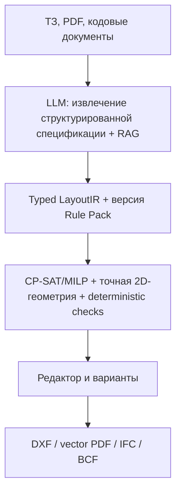

# Итог

Для производственного **AI Layout Configurator** рекомендую архитектуру **solver-first hybrid**:



LLM может разбирать ТЗ, объяснять варианты и предлагать изменения. Он не должен самостоятельно определять финальные координаты, «подтверждать» соответствие нормам или писать DXF/IFC напрямую.

Проверка выполнена по официальным репозиториям, документации, страницам продуктов и первичным публикациям. Срез: **28.08.2026 UTC**. GitHub-звёзды и forks — динамический снимок; если GitHub не показывал дату последнего коммита, указано `не найдено`, а не предполагаемая дата. Метрики:

* `[A]` — измерение авторов статьи/репозитория;
* `[V]` — утверждение поставщика;
* `[I]` — независимое измерение. Для коммерческих продуктов независимых benchmark’ов не найдено.

Главный вывод: ни один проверенный продукт или research-проект не демонстрирует одновременно произвольное ТЗ, многоэтажность, точные площади, строительные нормы, editable DXF, vector PDF, полноценный IFC и доказанный round-trip.

---

## 1. Open-source технологии

### 1.1. Основные проекты

| Проект                                                                                                                 | Назначение и стек                                                                                                                                     | Лицензия / SPDX                                                                         | GitHub-снимок                                                                                  | Артефакты, производительность и ограничения                                                                                                                                                                                                                                                                                                                                         |
| ---------------------------------------------------------------------------------------------------------------------- | ----------------------------------------------------------------------------------------------------------------------------------------------------- | --------------------------------------------------------------------------------------- | ---------------------------------------------------------------------------------------------- | ----------------------------------------------------------------------------------------------------------------------------------------------------------------------------------------------------------------------------------------------------------------------------------------------------------------------------------------------------------------------------------- |
| [ezdxf](https://github.com/mozman/ezdxf), [docs](https://ezdxf.readthedocs.io/)                                        | Python-библиотека для чтения/создания/изменения DXF; R12–R2018, modelspace/paperspace/block, layers, linetypes, text styles, HATCH, DIMENSION, blocks | MIT                                                                                     | Stars: не отображались; forks: 268; commits: 9,181; last commit: не найдено                    | PyPI/wheels, исходники. Add-ons позволяют выводить SVG/PDF/PNG. Отличный DXF writer, но нет семантических `Wall/Door/Window`: их нужно строить как линии, полилинии, blocks и XDATA. Round-trip сохраняет много неизвестных тегов, но это не гарантирует семантическую совместимость с AutoCAD/Revit. Производительность: официальные возможности, независимый benchmark не найден. |
| [LibreDWG](https://github.com/libredwg/libredwg)                                                                       | C-библиотека DWG/DXF; `dwg2dxf`, `dxf2dwg`, SVG/PS utilities                                                                                          | GPL-3.0-or-later                                                                        | Stars: 1.6k; forks: 347; commits: 7,968; last commit: не найдено                               | Исходники/nightly. README заявляет приблизительно 90% DWG→DXF и 80% DXF→DWG `[A: maintainer claim]`; запись R2010–R2018 всё ещё имеет ограничения/CRC-проблемы. Не использовать как единственный production DWG round-trip без большого тестового корпуса.                                                                                                                          |
| [FreeCAD](https://github.com/FreeCAD/FreeCAD), [downloads](https://www.freecad.org/downloads.php?lang=en)              | Параметрический CAD, Python/C++, Qt, Coin3D, Open CASCADE; Sketcher, TechDraw, Architecture/BIM workbenches                                           | LGPL-2.1-only по содержанию репозитория; upstream не указывает SPDX-строку отдельно     | Stars: не отображались; forks: около 6k; commits: 48,279; последний видимый коммит: 28.08.2026 | Официальные Windows/macOS/Linux installers; `FreeCADCmd` для headless. Может создавать архитектурные элементы через workbenches, TechDraw, размеры, шаблоны листов. Хорош как 3D/2D QA и authoring bridge, но не готовый code-compliance engine и не простой серверный core.                                                                                                        |
| [Open CASCADE Technology](https://github.com/Open-Cascade-SAS/OCCT), [official site](https://dev.opencascade.org/)     | C++ B-rep/NURBS/solid geometry kernel, CAD exchange, visualization                                                                                    | LGPL-2.1-only + специальное OCCT-исключение; точное составное SPDX-выражение не найдено | Stars: 2.8k; forks: 663; commits: 7,159; last commit: не найдено                               | Исходники и официальные releases. Хорош для robust 3D geometry, но не содержит BIM-семантики, строительных правил, DXF/PDF drawing system.                                                                                                                                                                                                                                          |
| [CadQuery](https://github.com/CadQuery/cadquery)                                                                       | Python-параметрический CAD поверх OCCT; headless, STEP/DXF/STL/3MF/VRML export                                                                        | Apache-2.0                                                                              | Stars: не отображались; forks: 531; commits: 2,229; last commit: не найдено                    | pip/conda/pixi, Docker/Apptainer, wheels. Удобен для параметрических стен и объёмов, но IFC-семантика, размерные стили, title blocks и полноценные architectural drawings требуют собственного кода.                                                                                                                                                                                |
| [IfcOpenShell](https://github.com/IfcOpenShell/IfcOpenShell), [docs](https://docs.ifcopenshell.org/)                   | C++/Python IFC parser, geometry engine, IFC authoring/conversion; IFC2x3, IFC4, IFC4.3                                                                | Основная часть: LGPL-3.0-or-later; отдельные компоненты имеют собственные лицензии      | Stars: 2.7k; forks: 954; commits: 22,582; точная дата последнего коммита не подтверждена       | Исходники, Python packages, `IfcConvert`, `ifctester`, `ifcclash`, `ifcpatch`. Лучший кандидат для IFC export/validation в Python-стеке. IFC — BIM-модель, не 2D CAD sheet и не DXF/PDF writer.                                                                                                                                                                                     |
| [Bonsai](https://bonsaibim.org/), [repo](https://github.com/IfcOpenShell/IfcOpenShell)                                 | Former BlenderBIM; Blender add-on для IFC authoring/editing/QA                                                                                        | GPL-3.0-or-later                                                                        | Отдельной статистики нет; входит в IfcOpenShell monorepo                                       | Требует Blender; официальные требования указывают Blender 4.3–4.5 и Python 3.11. Хорош для интерактивной проверки IFC и демонстрации, но не лучший headless production dependency.                                                                                                                                                                                                  |
| [Shapely](https://github.com/shapely/shapely)                                                                          | Python API над GEOS: polygon boolean, buffer, union/intersection, containment, spatial predicates                                                     | BSD-3-Clause                                                                            | Stars: 4.5k; forks: 631; commits: 2,496; last commit: не найдено                               | PyPI. Базовый 2D geometry validator для LayoutIR. Не создаёт DXF/PDF/IFC и не знает про стены/двери как BIM-сущности.                                                                                                                                                                                                                                                               |
| [CGAL](https://www.cgal.org/), [Boolean operations](https://doc.cgal.org/latest/Boolean_set_operations_2/index.html)   | C++ exact computational geometry, polygon/polyhedron boolean operations                                                                               | GPL-3.0-or-later OR commercial; dual licensing                                          | Stars/forks/last commit: не найдены в проверенных источниках                                   | Исходники. Полезен для особо строгих predicates и сложных полигонов; коммерческая лицензия требует отдельной проверки.                                                                                                                                                                                                                                                              |
| [OR-Tools](https://github.com/google/or-tools)                                                                         | C++/Python/C#/Java; CP-SAT, linear/MIP, routing, graph algorithms                                                                                     | Apache-2.0                                                                              | Stars: 14.0k; forks: 2.5k; commits: 15,819; last commit: не найдено                            | pip, NuGet, Maven, исходники/binaries. Лучший кандидат для room packing, non-overlap, area ranges, adjacency, boundary, objectives. Не geometry kernel — нужен Shapely/собственная геометрия.                                                                                                                                                                                       |
| [Z3](https://github.com/Z3Prover/z3)                                                                                   | SMT theorem prover; Boolean/integer/real logic, Python/C++/.NET/Java/JS bindings                                                                      | MIT                                                                                     | Stars: 12.6k; forks: 1.7k; commits: 22,829; last commit: не найдено                            | Binaries и bindings. Хорош для логических правил, конфликтов и условий применимости. Не заменяет spatial solver.                                                                                                                                                                                                                                                                    |
| [ReportLab](https://docs.reportlab.com/reportlab/userguide/ch2_graphics/), [PyPI](https://pypi.org/project/reportlab/) | Python PDF generation; paths, lines, arcs, Bézier, text, vector graphics                                                                              | BSD; точный BSD-вариант SPDX в официальном источнике не найден                          | GitHub stars/forks/last commit: не найдены                                                     | pip/PyPI. Подходит для vector PDF, dimensions, title blocks, legends и hatches, но всё это нужно моделировать самостоятельно. DXF round-trip отсутствует.                                                                                                                                                                                                                           |
| [WeasyPrint](https://github.com/Kozea/WeasyPrint), [docs](https://doc.courtbouillon.org/weasyprint/stable/)            | HTML/CSS → PDF; SVG в PDF остаётся векторным                                                                                                          | BSD-3-Clause                                                                            | Stars: 9,534; forks: 862; commits: 6,602; last pushed: 25.08.2026                              | pip. Хорош для листов, отчётов, title blocks, legends и SVG geometry. Не CAD-модель, нет DXF semantics.                                                                                                                                                                                                                                                                             |
| [CairoSVG](https://github.com/Kozea/CairoSVG), [site](https://cairosvg.org/)                                           | SVG → PDF/PS/PNG/SVG через Cairo                                                                                                                      | LGPL-3.0; точный suffix SPDX не показан                                                 | Stars: 949; forks: 167; commits: 1,025; last commit: не найдено                                | pip/CLI. Хороший последний этап `LayoutIR → SVG → vector PDF`; не поддерживает DXF round-trip.                                                                                                                                                                                                                                                                                      |
| [xBIM Essentials](https://github.com/xBimTeam/XbimEssentials), [docs](https://docs.xbim.net/)                          | .NET IFC/STEP/IfcXML/IfcZIP toolkit, geometry, validation, BCF/COBie                                                                                  | CDDL-1.0                                                                                | Stars/forks/last commit: не найдены в проверенной странице                                     | NuGet/source. Сильная альтернатива IfcOpenShell для .NET. [xBim.IDS.Validator](https://github.com/xBimTeam/Xbim.IDS.Validator) лицензирован AGPL-3.0-only, поэтому требует отдельного лицензионного анализа.                                                                                                                                                                        |
| [BIMserver](https://github.com/opensourceBIM/bimserver), [site](https://bimserver.org/)                                | Java IFC server, model versioning, merging, project structures, model checking                                                                        | AGPL-3.0-only; плагины могут иметь другие лицензии                                      | Stars: 1.7k; forks: 645; last commit: не найдено                                               | Исходники. Полезен как CDE/model repository, но не нужен для MVP генератора.                                                                                                                                                                                                                                                                                                        |

### 1.2. DWG и headless rendering

[ODA File Converter](https://www.opendesign.com/guestfiles/oda_file_converter) — proprietary bridge для DWG/DXF conversion с GUI и CLI. Официальная страница предлагает Windows/Linux/macOS packages и trial; SPDX-лицензии нет. Это разумный опциональный адаптер для DWG, но его нельзя делать обязательной зависимостью open deployment.

Для headless pipeline:

* [FreeCADCmd](https://wiki.freecad.org/Headless_FreeCAD) — headless FreeCAD;
* [Blender background rendering](https://docs.blender.org/manual/en/latest/advanced/command_line/render.html) — `--background`, без GUI/display;
* [`IfcConvert`](https://docs.ifcopenshell.org/ifcconvert.html) — IFC→SVG, GLB, OBJ, STEP, IGES и другие форматы;
* собственный SVG→[CairoSVG](https://cairosvg.org/) или [WeasyPrint](https://weasyprint.org/) — предсказуемый vector PDF.

### 1.3. Capability matrix

`✓` — встроено/семантически; `△` — возможно примитивами или кастомным кодом; `—` — не является назначением проекта.

| Технология              |           Walls | Doors/windows |                          Layers |             Blocks | Hatches/dimensions | Title block |          Vector PDF |                                    DXF round-trip |
| ----------------------- | --------------: | ------------: | ------------------------------: | -----------------: | -----------------: | ----------: | ------------------: | ------------------------------------------------: |
| ezdxf                   |               △ |             △ |                               ✓ |                  ✓ |                  ✓ |           △ |                   △ |                                                 △ |
| LibreDWG                |               △ |             △ |                               △ |                  △ |                  △ |           △ | ограниченный SVG/PS |                                △, версия-зависимо |
| FreeCAD TechDraw/Draft  |             ✓/△ |           ✓/△ |                               △ |                  △ |                  ✓ |           ✓ |                   ✓ |                                                 △ |
| CadQuery                | △, через solids |             △ |                               △ |                  △ |                  △ |           △ |                   — |                                                 △ |
| IfcOpenShell/Bonsai     |           ✓ BIM |         ✓ BIM | IFC presentation, не CAD layers |                  — |           —/custom |    —/custom |                   — |                                        —/external |
| ReportLab               |    △, рисование |             △ |                               — | reusable functions |                  △ |           △ |                   ✓ |                                                 — |
| SVG/CairoSVG/WeasyPrint |        △, paths |    △, symbols |                      SVG groups |    reusable groups |                  △ |           △ |                   ✓ |                                                 — |
| ODA File Converter      |               △ |             △ |                               ✓ |                  ✓ |                  ✓ |           △ |                   — | лучший из проверенных DWG bridges, но proprietary |

Критическое различие: **DXF — это drawing exchange format, а IFC — семантическая BIM-модель**. Нельзя считать экспорт DXF доказательством наличия `IfcWall`, `IfcDoor`, материалов, пространственной структуры или корректного BIM round-trip.

---

## 2. AI и алгоритмическая генерация планировок

### 2.1. Public code и datasets

| Проект                                                                                                                      | Input → output; реальные constraints                                                                                                                         | Лицензия                                                                                                              | GitHub-снимок                                                                                       | Артефакты / performance / ограничения                                                                                                                                                                                                                                                                          |
| --------------------------------------------------------------------------------------------------------------------------- | ------------------------------------------------------------------------------------------------------------------------------------------------------------ | --------------------------------------------------------------------------------------------------------------------- | --------------------------------------------------------------------------------------------------- | -------------------------------------------------------------------------------------------------------------------------------------------------------------------------------------------------------------------------------------------------------------------------------------------------------------- |
| [HouseGAN](https://github.com/ennauata/housegan)                                                                            | Bubble/layout graph → axis-aligned room boxes/segmentation. Graph adjacency используется как условие, но точные площади, circulation и code не гарантируются | GPL v3 + дополнительное “research purposes only”; не чистый SPDX; практически `GPL-3.0-only + additional restriction` | 293 stars; 77 forks; 44 commits; last commit: не найдено                                            | Code, pretrained model и LIFULL subset доступны через repo. Метрики — `[A]`; output не CAD/BIM, не DXF.                                                                                                                                                                                                        |
| [HouseGAN++](https://github.com/ennauata/houseganpp)                                                                        | RPLAN/bubble graph → room segmentation/vector-like layout; graph constraints и iterative refinement                                                          | GPL v3 + research-only restriction                                                                                    | 254 stars; 48 forks; 5 commits; last commit: не найдено                                             | Code/checkpoints/data links в repo. Нет доказанных hard area/circulation/code constraints; output не DXF/IFC.                                                                                                                                                                                                  |
| [Graph2Plan](https://github.com/HanHan55/Graph2plan), [paper](https://arxiv.org/abs/2004.13204)                             | Layout graph + building boundary → raster plan + refined room boxes; boundary и graph входят в pipeline                                                      | License file не найдено; `unverified`                                                                                 | 346 stars; 83 forks; 27 commits; last commit: не найдено                                            | Code/web demo/RPLAN processing. Boundary/graph enforced at model interface, но не доказана математическая гарантия; Windows/старые Python/MATLAB dependencies.                                                                                                                                                 |
| [CubiCasa5K](https://github.com/CubiCasa/CubiCasa5k)                                                                        | Raster plan → segmentation, heatmaps, polygons; 5,000 images, 80+ object categories                                                                          | Dataset/model license не найдена в проверенном official repo                                                          | 568 stars; 156 forks; last commit: не найдено                                                       | Dataset через Zenodo, pretrained weights через Google Drive. Это recognition/vectorization, не conditional generator.                                                                                                                                                                                          |
| [FloorPlanCAD](https://floorplancad.github.io/)                                                                             | Architectural symbol spotting/panoptic annotations, SVG/PNG/COCO; не генератор                                                                               | Annotation site: CC-BY-NC-4.0; code license не найдена                                                                | Repo code указано как no longer maintained; stats/last commit: не найдены                           | Useful для parsing, но code/data provenance ограничивает commercial training.                                                                                                                                                                                                                                  |
| [Tell2Design](https://github.com/LengSicong/Tell2Design), [paper](https://arxiv.org/abs/2311.15941)                         | Natural language describing room semantics, geometry and topology → room-box sequence/JSON                                                                   | Code Apache-2.0; dataset CC-BY-NC-4.0                                                                                 | 85 stars; 10 forks; last commit: не найдено                                                         | Code, data links, PyTorch/T5-like baseline. Paper reports micro IoU 54.34 and macro IoU 53.30 `[A]`; это research metric, не construction accuracy.                                                                                                                                                            |
| [HouseDiffusion](https://github.com/aminshabani/house_diffusion), [paper](https://arxiv.org/abs/2211.13287)                 | Bubble graph → vector polygon loops for rooms/doors; supports non-Manhattan shapes and corner counts                                                         | GPL-3.0; exact SPDX suffix не показан                                                                                 | 235 stars; 54 forks; 3 commits; last commit: не найдено                                             | Code/checkpoint links. Repo прямо предупреждает о незавершённости. Нет exact area/material/code validation; output not DXF/IFC.                                                                                                                                                                                |
| [GSDiff](https://github.com/SizheHu/GSDiff), [paper](https://arxiv.org/abs/2408.16258)                                      | Diffusion + Transformer: graph of wall junctions/segments → room polygons/vector structural graph                                                            | GPL-3.0; exact variant не показан                                                                                     | 32 stars; 8 forks; 130 commits; last commit: не найдено                                             | Weights links; RPLAN processing; RPLAN-derived data redistribution restricted. “Surpasses SOTA” — `[A]`, no independent replication found.                                                                                                                                                                     |
| [ChatAssistDesign](https://github.com/l1060230026/layout)                                                                   | Language edits → iterative vector floorplan diffusion based on HouseDiffusion                                                                                | GPL v3 + research/commercial restriction                                                                              | 0 stars; 1 fork; 1 commit; last commit: не найдено                                                  | Code/weights advertised but repo says unclean and some features may not work. No code constraints.                                                                                                                                                                                                             |
| [DStruct2Design / DS2D](https://github.com/plstory/ds2d), [paper](https://arxiv.org/abs/2407.15723)                         | Structured JSON constraints → structured layout JSON; RPLAN and ProcTHOR; Llama3-8B LoRA                                                                     | Apache-2.0                                                                                                            | 32 stars; 5 forks; 15 commits; last commit: не найдено                                              | Code, converted ProcTHOR, Google Drive pretrained LoRA. Supports partial/complete numerical constraints at benchmark level, not building codes or IFC.                                                                                                                                                         |
| [floor-plan-rlvr](https://github.com/ludolara/floor-plan-rlvr)                                                              | JSON input: room count, total area, room constraints, bubble graph → JSON with room polygons, doors, areas, coordinates; SFT + RLVR + vLLM                   | License не найдена; `unverified`                                                                                      | 5 stars; 0 forks; 70 commits; last commit: не найдено                                               | Code and Hugging Face checkpoints: [SFT](https://huggingface.co/ludolara/fp5-sft-Llama3.3-70B), [RLVR](https://huggingface.co/ludolara/fp5-rlvr-Llama3.3-70B). Rewards verify JSON, non-overlap, connectivity, total area. README metrics are `[A: maintainer/paper]`; no boundary/code/circulation guarantee. |
| [DiffPlanner](https://github.com/shidong-wang/DiffPlanner), [paper](https://arxiv.org/abs/2508.13738)                       | Conditional diffusion/Transformer; boundary, bubble graph and other conditions → vector plan                                                                 | Repo license не показана; paper arXiv license CC-BY-NC-ND-4.0                                                         | 7 stars; 2 forks; last commit: не найдено                                                           | Preprocessed RPLAN/temp weights advertised. “SOTA” — `[A]`; not independent.                                                                                                                                                                                                                                   |
| [CE2EPlan](https://github.com/shidong-wang/CE2EPlan), [paper](https://arxiv.org/abs/2602.20377)                             | Topology/geometry-enhanced diffusion, GATransformer, masked multi-condition → vector polygons                                                                | Repo license не показана; paper license only                                                                          | 2 stars; 0 forks; 4 commits; last commit: не найдено                                                | Weights via Google Drive; Python 3.9/PyTorch 2.0. No code/DXF/IFC; paper claims performance `[A]`.                                                                                                                                                                                                             |
| [MANSION](https://github.com/AgibotGeneral/MANSION), [paper](https://arxiv.org/abs/2603.11554)                              | Natural language → LLM-driven procedural multi-floor 3D scenes: room segmentation, walls, doors, windows, furniture, lighting, renders                       | Apache-2.0                                                                                                            | 32 stars; 3 forks; 2 commits; last commit: не показан                                               | Code, Python setup, AI2-THOR/Objaverse assets, MansionWorld dataset. Strong reference for LLM→intermediate representation→procedural solver and vertical alignment, но не IFC/DXF/code checker.                                                                                                                |
| [MSD](https://github.com/caspervanengelenburg/msd), [dataset page](https://caspervanengelenburg.github.io/msd-eccv24-page/) | 5,372 complex floorplans, 18.9k apartments, image/geometry/graph, multi-unit buildings, orientation                                                          | Dataset page indicates CC-BY-SA-4.0; code license не найдена                                                          | 130 stars; 11 forks; 14 commits; last commit: не найдено                                            | Kaggle data, graph extraction code. Model code still marked “will be released soon”; existing methods degrade on this dataset.                                                                                                                                                                                 |
| [SYNBUILD-3D](https://github.com/kdmayer/SYNBUILD-3D), [dataset](https://purl.stanford.edu/kz908vb7844)                     | Synthetic 6.2M+ semantic LoD4 buildings, floorplan images and roof point clouds                                                                              | CC-BY-4.0                                                                                                             | 107 stars; 9 forks; 12 commits; last commit: не найдено                                             | Dataset/sample download. Generation pipeline code “will be added soon”; not a layout solver or BIM exporter.                                                                                                                                                                                                   |
| [MLStructFP](https://github.com/MLSTRUCT/MLStructFP)                                                                        | 954 large-scale floorplans; wall/slab polygons in JSON, metric coordinates, raster/vector consistency                                                        | Code MIT; dataset terms separately not clearly exposed                                                                | Stars: не показаны; forks: 9; commits: 139; last commit: не найдено; repository archived 29.04.2026 | pip package; dataset via request form. Useful for recognition and wall geometry, not generation; archived.                                                                                                                                                                                                     |
| [AFPlan](https://github.com/cansik/architectural-floor-plan)                                                                | Java/Gradle image analysis: morphology, ML, convex hull, connected components → CSV/SVG room geometry                                                        | License не найдена; `unverified`                                                                                      | 399 stars; 87 forks; 428 commits; last commit: не найдено                                           | Source; no packaged installer. README says DXF/DWG output was planned, but converter license was not finalized. Prototype for scan/raster ingestion.                                                                                                                                                           |
| [CubiGraph5K](https://github.com/luyueheng/CubiGraph5K)                                                                     | CubiCasa SVG → graph; adjacency, door-connectivity and shortest room paths                                                                                   | License не найдена                                                                                                    | 42 stars; 5 forks; 14 commits; last commit: не найдено                                              | Code + `data.json`; useful graph extraction, not generator.                                                                                                                                                                                                                                                    |
| [Hypergraph](https://github.com/ramonweber/hypergraph)                                                                      | C#/.NET geometry/research library, hypergraph floorplans, Rhino/Grasshopper, environmental analysis                                                          | MIT                                                                                                                   | 90 stars; 14 forks; 54 commits; last commit: не найдено                                             | Source, Docker/API, Rhino samples. README reports `<2s`, `<3s`, `<0.1s` and ~10s environmental simulation `[A: self-measured]`; requires Rhino/Climate Studio for samples.                                                                                                                                     |
| [FloorSet](https://github.com/IntelLabs/FloorSet)                                                                           | VLSI rectilinear floorplanning dataset: area targets, connectivity, boundary/preplaced/cluster constraints                                                   | Code Apache-2.0; dataset CC-BY-4.0                                                                                    | 117 stars; 34 forks; last commit: не найдено                                                        | 2M synthetic layouts. Useful algorithmic inspiration only; not building architecture.                                                                                                                                                                                                                          |

### 2.2. Paper-only or not-yet-reproducible work

| Проект / источник                                                                                            | Метод и constraints                                                                                         | License/artifacts/stats                                                                          | Вывод                                                                                                                                                                                                                                                      |
| ------------------------------------------------------------------------------------------------------------ | ----------------------------------------------------------------------------------------------------------- | ------------------------------------------------------------------------------------------------ | ---------------------------------------------------------------------------------------------------------------------------------------------------------------------------------------------------------------------------------------------------------- |
| [RPLAN](http://staff.ustc.edu.cn/~fuxm/projects/DeepLayout/index.html)                                       | Residential floorplan dataset, около 80k plans; primarily raster/annotation-based                           | Official download requires request; license and current access: `unverified`                     | Benchmark foundation, but residential/single-floor bias and uncertain commercial rights.                                                                                                                                                                   |
| [ResPlan](https://arxiv.org/abs/2508.14006)                                                                  | 17,000 vector-graph residential plans; walls, doors, windows, rooms; metric-scale coordinates               | Paper states CC-BY-4.0 for data; exact code/data repository and GitHub stats not found           | One of the best candidates for licensed vector pretraining; still residential and not code-aware.                                                                                                                                                          |
| [FML/FMLM](https://arxiv.org/abs/2604.04859), [project](https://mapooon.github.io/FMLPage/)                  | Floorplan Markup Language; Transformer next-token generation for boundary, graph, partial-layout conditions | Project page CC-BY-SA-4.0; code/weights/stats not found                                          | Promising structured representation, but no verified production artifacts.                                                                                                                                                                                 |
| [TLC-Plan](https://github.com/rosolose/TLC-PLAN), [paper](https://arxiv.org/abs/2602.07100)                  | Hierarchical VQ/codebook + autoregressive Transformer; boundary/vector generation                           | Repo has 1 star, 0 forks, 2 commits; license/code/weights not found                              | Paper reports FID 1.84/MSE 2.06 `[A]`; repository is not reproducible enough for product use.                                                                                                                                                              |
| [GRE-Diff](https://arxiv.org/html/2607.08086v1)                                                              | Gaussian room embeddings + conditional diffusion + boundary/room resampling                                 | No code/weights/license found                                                                    | Reports BC 98.44%, RC 100%, F1 99.21% on RPLAN `[A]`; resampling is not a legal/code engine.                                                                                                                                                               |
| [GFLAN](https://arxiv.org/abs/2512.16275)                                                                    | Boundary + front door → Stage A centroid placement, Stage B heterogeneous graph + Transformer/GNN polygons  | Code/weights/license/stats not found                                                             | Particularly relevant architecture: topology first, geometry second. No verified implementation.                                                                                                                                                           |
| [GreenPlanner](https://arxiv.org/html/2512.00406v1)                                                          | RPLAN → DesignFD/PDE/GreenPD/GreenFlow; EUI, fire distance, floor area, connectivity                        | Paper says code/data “will be available”; no verified repo/weights/license                       | Paper reports PDE `R² > .99`, 7.3 ms/100 cases and 100% GreenPD compliance `[A]`. Its “compliance” covers a limited Chinese residential metric set, not universal building-code compliance. The PDE is a learned surrogate, not a deterministic authority. |
| [FloorplanMAE](https://arxiv.org/abs/2506.08363)                                                             | Masked autoencoder/ViT: partial floorplan → completed floorplan                                             | Code/weights/license not found                                                                   | Completion model, not specification-to-layout; no hard area/adjacency/code guarantees.                                                                                                                                                                     |
| [FloorPlan-LLaMa](https://github.com/TsinghuaJunYin/FloorPlan-LLaMa)                                         | VQ-VAE + autoregressive model + architect-preference reward model/RLHF                                      | Repo has 24 stars, 2 forks, 16 commits; license not shown; TODO still lists code/weights release | Valuable for human-preference evaluation; output and release status are incomplete.                                                                                                                                                                        |
| [DPLAN](https://arxiv.org/abs/2606.21159)                                                                    | Graph-based: required/forbidden door adjacency → rectangular/orthogonal floorplan                           | No code/weights/license/stats verified                                                           | Explicitly supports rectangular boundary, non-overlap, required/non-required connections. Future work lists non-rectangular boundaries, dimension scaling and circulation; closest research precedent to a solver, but incomplete.                         |
| [G2PLAN](https://onlinelibrary.wiley.com/doi/10.1111/cgf.14451)                                              | Graph-theoretic + linear optimization; topological/dimensional constraints                                  | No verified code/license/weights/stats                                                           | Good literature precedent for enumerating layouts under constraints; paper performance only `[A]`.                                                                                                                                                         |
| [MIQP interior layout](https://onlinelibrary.wiley.com/doi/10.1111/cgf.13380)                                | Mixed-integer quadratic programming; room size/position/adjacency/building outline                          | No verified code/license/weights                                                                 | Directly supports the solver-first direction, but not a reusable product implementation.                                                                                                                                                                   |
| [Procedural constrained floorplans](https://publications.graphics.tudelft.nl/rails/active_storage/blobs/...) | Procedural topology/area control and multi-floor reachability                                               | Code/license not found                                                                           | Relevant algorithmic idea; not a deployable artifact.                                                                                                                                                                                                      |
| [MRED-14](https://dl.acm.org/doi/10.1145/3746027.3754949)                                                    | Multimodal low-energy residential dataset with 14 input types                                               | Dataset/code/license not verified in checked primary source                                      | Useful energy-aware benchmark, but not a universal compliance system.                                                                                                                                                                                      |
| [Tell2Floorplan dataset](https://github.com/spatialxia/Tell2Floorplan-dataset)                               | Rule-enriched and LLM-recognized natural-language descriptions of RPLAN                                     | MIT repository; 1 star, 0 forks, 3 commits; last commit not found                                | Downloadable ZIPs; underlying RPLAN commercial rights remain unresolved.                                                                                                                                                                                   |

### 2.3. Что действительно является hard constraint

На практике нужно различать:

* **условие на входе модели**: “boundary given”;
* **loss/reward penalty**: модель старается не нарушать;
* **post-processing**: нарушение исправляется эвристикой;
* **доказуемое ограничение solver’а**: кандидат не принимается, пока условие не выполнено.

Из проверенных работ только solver/procedural подходы могут давать настоящую гарантию — и только для тех правил, которые явно закодированы. Даже RLVR-модель может выдать ошибочный output на inference; reward training не заменяет повторную проверку.

---

## 3. Building-code compliance, BIM, ACC и RAG

### 3.1. OpenBIM и правила

| Проект/стандарт                                                                                                                                                                                                                                                   | Назначение                                                                                | License / stats / artifacts                                                                       | Что он не делает                                                                                                                                                                                                                   |
| ----------------------------------------------------------------------------------------------------------------------------------------------------------------------------------------------------------------------------------------------------------------- | ----------------------------------------------------------------------------------------- | ------------------------------------------------------------------------------------------------- | ---------------------------------------------------------------------------------------------------------------------------------------------------------------------------------------------------------------------------------- |
| [IFC](https://www.buildingsmart.org/standards/bsi-standards/industry-foundation-classes/), [IFC 4.3](https://standards.buildingsmart.org/IFC/RELEASE/IFC4_3/)                                                                                                     | Industry Foundation Classes; текущая официальная ветка IFC 4.3 ADD2, ISO 16739            | Specification documents: CC-BY-ND-4.0; stars/forks/commits: N/A; schema/validation tools доступны | IFC — data model, не национальный building-code engine. Поддержка конкретных сущностей и MVD различается между приложениями.                                                                                                       |
| [IDS](https://github.com/buildingSMART/IDS), [official page](https://www.buildingsmart.org/standards/bsi-standards/information-delivery-specification-ids/)                                                                                                       | XML/XSD для машинно-читаемых требований к IFC-свойствам, сущностям и information delivery | CC-BY-ND-4.0; 316 stars; 89 forks; last commit: не найдено                                        | IDS хорошо проверяет наличие/значения BIM-информации, но не доказывает egress distance, fire compartment geometry, daylight или сложную доступность.                                                                               |
| [IfcTester](https://docs.ifcopenshell.org/ifctester.html)                                                                                                                                                                                                         | Python/CLI/web validation IFC against IDS; console/HTML/JSON/ODS/BCF outputs              | Наследует LGPL-3.0-or-later IfcOpenShell; отдельные stats N/A                                     | Для geometry/code checks нужны дополнительные deterministic rules.                                                                                                                                                                 |
| [bSDD](https://www.buildingsmart.org/users/services/buildingsmart-data-dictionary/), [API](https://technical.buildingsmart.org/services/bsdd/using-the-bsdd-api/), [license](https://technical.buildingsmart.org/services/bsdd/license/)                          | REST/OpenAPI/OAuth2 dictionary of classes/properties/material concepts                    | Per-dictionary licensing; единого SPDX нет; repo stats не найдены                                 | Семантическая нормализация, не юридический код и не spatial solver.                                                                                                                                                                |
| [BCF API](https://github.com/buildingSMART/BCF-API)                                                                                                                                                                                                               | Issues, viewpoints, связи с IFC-компонентами, coordination workflow                       | License/stats/last commit: не найдены                                                             | Issue exchange, не генерация и не проверка норм.                                                                                                                                                                                   |
| [xBIM.IDS.Validator](https://github.com/xBimTeam/Xbim.IDS.Validator)                                                                                                                                                                                              | .NET IDS validation                                                                       | AGPL-3.0-only; 17 stars; 8 forks; 289 commits; last commit: не найдено                            | README сообщает 100% pass IDS test cases `[A: maintainer claim]`; AGPL может быть несовместима с закрытым продуктом без отдельной лицензии.                                                                                        |
| [BIMserver](https://github.com/opensourceBIM/bimserver)                                                                                                                                                                                                           | IFC model repository/versioning/merging                                                   | AGPL-3.0-only; 1.7k stars; 645 forks; last commit не найден                                       | CDE/model management, не code-compliance engine.                                                                                                                                                                                   |
| [Autodesk Forma/ACC APIs](https://aps.autodesk.com/developer/overview/forma), [Model Coordination API](https://aps.autodesk.com/en/docs/acc/v1/tutorials/model-coordination), [ACC Issues API](https://aps.autodesk.com/blog/acc-issues-api-general-availability) | Proprietary cloud: Data Management, Model Coordination, clash/issues workflows            | SPDX/stars/forks/last commit: N/A; APIs/SDKs доступны по Autodesk terms                           | Можно загружать модели, координировать их и создавать issues. Это не открытый движок строительных норм и не генератор LayoutIR. Официальные docs также фиксируют ограничения отдельных Model Coordination/Data Exchange workflows. |

### 3.2. Как строить RAG для норм

RAG должен быть **источником доказательства и кандидатов на правила**, но не финальным validator’ом.

Рекомендуемый pipeline:

1. Хранить для каждого фрагмента: jurisdiction, code edition, effective date, issuing authority, URL, document hash, page, clause и язык.
2. Разбивать документы по статьям/таблицам, а не только по страницам PDF.
3. RAG извлекает релевантную норму с цитатой.
4. LLM преобразует её в candidate rule.
5. Архитектор/code expert утверждает rule.
6. Компилятор переводит утверждённое правило в deterministic predicate/solver constraint.
7. Validator возвращает `pass`, `fail` или `unknown` с геометрическим evidence и ссылкой на clause.

Пример схемы без выдуманных нормативных значений:

```json
{
  "rule_id": "JURISDICTION-CODE-CLAUSE",
  "jurisdiction": "country/municipality",
  "edition": "code-edition",
  "effective_from": "YYYY-MM-DD",
  "source": {
    "url": "official-document-url",
    "page": 0,
    "clause": "section/table"
  },
  "applies_if": {
    "occupancy": ["residential"],
    "storey_count": {"min": 1}
  },
  "check": {
    "metric": "shortest_egress_path",
    "from": "occupied_space",
    "to": "exit",
    "operator": "<=",
    "value": "loaded-from-approved-rule-pack",
    "units": "m",
    "tolerance": "explicit"
  },
  "severity": "hard",
  "status": "approved"
}
```

Принципиально важны:

* версия нормы и дата действия;
* unit system и tolerance;
* различие `fail` и `unknown`;
* конфликт правил и precedence;
* трассировка от результата до геометрии и пункта документа;
* запрет фразы «соответствует строительным нормам», если часть правил не проверена.

Проверять нужно как минимум:

* границы участка и отступы;
* минимальные площади и размеры помещений;
* доступность и turning clearances;
* двери, ширины проходов и swing clearances;
* egress graph и длины маршрутов;
* stairs/elevators и вертикальную непрерывность;
* fire compartments и wall/fire-rating metadata;
* окна, daylight/ventilation proxies;
* parking, ramps, service access;
* IFC entities, properties и spatial containment.

---

## 4. Существующие продукты

| Продукт                                                                                                                                                                                                                                                                                            | Inputs / outputs / constraints                                                                                                 | Цена на проверенный момент                                                                                          | DXF / IFC                                                                     | Целевая аудитория и ограничения                                                                                                                       |
| -------------------------------------------------------------------------------------------------------------------------------------------------------------------------------------------------------------------------------------------------------------------------------------------------- | ------------------------------------------------------------------------------------------------------------------------------ | ------------------------------------------------------------------------------------------------------------------- | ----------------------------------------------------------------------------- | ----------------------------------------------------------------------------------------------------------------------------------------------------- |
| [Maket.ai](https://www.maket.ai/ai-floor-plan-generator), [pricing](https://www.maket.ai/pricing)                                                                                                                                                                                                  | Text prompt, uploaded plan; editable 2D, multi-floor, renders, PDF/DXF                                                         | Free: $0/50 credits; Homeowner: $20/mo; Pro: $100/mo; Scale custom                                                  | PDF/DXF заявлены; IFC не найден                                               | Homeowners/designers. Exact code/material semantics не подтверждены. “100% accuracy” human validation — `[V]`, не независимый benchmark.              |
| [TestFit](https://www.testfit.io/pricing), [integrations](https://www.testfit.io/product/integrations), [FAQ](https://support.testfit.io/knowledge/frequently-asked-questions-1)                                                                                                                   | Site, parking, unit types, density/feasibility inputs; many site options, pro formas, exports                                  | Parking Solver $195/mo; Site Solver from $15k/year; Portfolio from $20k/year; add-ons extra                         | CSV, DXF, glTF, PDF; SketchUp/Revit integration; IFC не найден                | Developers/architects, multifamily, parking, industrial, retail, hotel. Сильный feasibility/site planning, не room-level construction-code authoring. |
| [Finch3D](https://www.finch3d.com/product), [pricing](https://www.finch3d.com/get-started), [terms](https://www.finch3d.com/terms)                                                                                                                                                                 | Parametric design systems, libraries, rules; unit mix, circulation, door placement, BIM export                                 | Free; Basic €79/mo; Enterprise from €14,500/year for 3 seats                                                        | Revit/Archicad/Rhino/Grasshopper integrations; exact DXF/IFC export не найден | Architects/developers. AI “compliance” и local-code claims — `[V]`; legal certification не доказана.                                                  |
| [Autodesk Forma](https://www.autodesk.com/products/forma-site-design/overview), [Revit transfer](https://www.autodesk.com/learn/ondemand/tutorial/send-a-forma-proposal-to-revit), [Generative Design](https://www.autodesk.com/solutions/generative-design/architecture-engineering-construction) | Site design, analysis, goals/constraints/inputs, proposals; Revit Generative Design creates alternatives                       | Subscription/AEC Collection; exact current price не найден на проверенной странице                                  | IFC/OBJ import/export; Revit/Dynamo/Rhino; DXF не подтверждён                 | Site/early-stage AEC. Не специализированный text-to-room-layout engine и не универсальный code checker.                                               |
| [Planner5D](https://planner5d.com/pricing), [CAD export](https://planner5d.com/pro/exportcad), [B2B API](https://support.planner5d.com/en/articles/15189751-b2b-api-technical-overview)                                                                                                            | JPG/PNG/PDF/DWG/DXF recognition; editable 3D; CAD export; API returns structured model                                         | Free; Premium $4.99/mo annual or $19.99 monthly; Professional $33.33/mo annual or $49.99 monthly; Enterprise custom | DWG/DXF export; IFC/DWG/DXF API marked beta                                   | Home/interior planning and embedded B2B. Building codes, egress and permit semantics не заявлены.                                                     |
| [Hypar](https://hypar.io/), [plans/pricing](https://docs.hypar.io/plans-account-and-admin/plans-pricing-and-licenses)                                                                                                                                                                              | Reusable parametric functions, design options, clearances/clash detection, DWG import/export                                   | Free limited; Individual/team $100/mo or $1,000/year/user; Enterprise custom                                        | DWG/DXF; Revit-compatible; IFC exact support не найден                        | Design automation/BIM teams. Очень полезен как inspiration for function library, но не turnkey jurisdictional code engine.                            |
| [ARCHITEChTURES](https://architechtures.com/en), [exports](https://architechtures.com/en/blog/posts/t8-downloading-files-xls-cad-bim)                                                                                                                                                              | Residential criteria: min/max areas, dimensions, heights, vertical circulation, parking/ramps; outputs metrics, XLSX, DXF, IFC | 7-day trial; exact price не найден                                                                                  | DXF и IFC заявлены; IFC LOD 200+ — `[V]`                                      | Residential feasibility. “99% reduction/100% error-free” — vendor claims, not independent evidence; limited typology/jurisdiction scope.              |
| [Snaptrude](https://www.snaptrude.com/)                                                                                                                                                                                                                                                            | Prompt/PDF/RFP/program spreadsheet → 2D/3D massing/BIM; Revit export, areas, adjacencies                                       | Free trial; exact price не найден                                                                                   | Revit `.rvt`; IFC/DXF exact support не подтверждён                            | Browser BIM for AEC. “AI reasoning/building logic” is vendor claim; rule implementation is not publicly documented.                                   |

Все перечисленные коммерческие системы являются proprietary/non-SPDX. GitHub stars/forks/last commit и downloadable source для них не применимы.

---

## 5. Рекомендуемая архитектура

### 5.1. Canonical model: `LayoutIR`

Не следует делать DXF или PNG canonical representation. Нужен versioned typed model:

```text
Project
 ├── Site / building envelope
 ├── Levels / storeys
 ├── Vertical cores: stairs, lifts, shafts
 ├── Spaces: id, type, target/min/max area, min dimensions
 ├── Relations: required/preferred/forbidden adjacency
 ├── Openings: doors, windows, width, swing, host wall
 ├── Assemblies: wall/floor/roof types, thickness, fire rating
 ├── Ruleset IDs and code edition
 ├── Constraints and objective weights
 └── provenance: seed, solver version, rule hash, export hashes
```

Каждый room/wall/door/window должен иметь стабильный ID. Это позволяет после редактирования сохранить связи, BIM GUID mapping и историю проверок.

### 5.2. Слои

**Parsing layer**

* LLM with JSON Schema/structured output;
* unit normalization;
* contradiction detection;
* clarification workflow;
* RAG with citations.

**Generation layer**

* OR-Tools CP-SAT для integer/grid layout;
* MILP/MIQP для более сложных objectives;
* Shapely/GEOS для exact 2D predicates;
* graph search для connectivity/egress;
* optional Z3 для logical applicability/conflict checks;
* procedural templates for known building typologies.

**Neural layer**

Optional:

* HouseDiffusion/GSDiff/CE2EPlan — proposal priors;
* floor-plan-rlvr/DStruct2Design — structured JSON research;
* GreenPlanner — energy surrogate exploration;
* preference model — ranking.

Neural result всегда проходит через deterministic geometry validator и solver repair/rejection.

**Export layer**

* `ezdxf` для DXF;
* собственный SVG scene graph;
* CairoSVG/WeasyPrint/ReportLab для vector PDF;
* IfcOpenShell для IFC;
* IfcTester/IDS for information validation;
* BCF for issue reports;
* IfcConvert/Bonsai/FreeCADCmd/Blender для previews and QA.

**UI**

Редактор должен применять типизированные commands:

```text
MoveRoom(id, delta)
ResizeRoom(id, target_area)
AddDoor(host_wall, position, width)
ChangeAdjacency(room_a, room_b, relation)
ChangeMaterial(wall_id, material_id)
```

После команды система локально пересчитывает geometry, constraints и exports. Не следует отправлять пользователю «свободный prompt», который сразу переписывает координаты.

---

## 6. Сравнение подходов

| Подход                  | Сильные стороны                                           | Слабые стороны                                         | Рекомендация                                              |
| ----------------------- | --------------------------------------------------------- | ------------------------------------------------------ | --------------------------------------------------------- |
| GAN                     | Быстрые правдоподобные residential layouts                | Soft constraints, низкая explainability, raster/boxes  | Только research prior                                     |
| Diffusion               | Разнообразие, vector-like outputs, conditional generation | Дорого, трудно гарантировать geometry/code             | Proposal/ranking                                          |
| Transformer/LLM         | JSON, язык, iterative interaction                         | Ошибки координат, топологические и численные нарушения | Parsing, editing commands, optional structured generation |
| GNN/graph models        | Adjacency/topology, relational structure                  | Недостаток размеров, материалов, code semantics        | Topology proposal/ranking                                 |
| Procedural templates    | Повторяемость, explainability, быстрый MVP                | Ограниченная вариативность                             | Первый production generator                               |
| CP-SAT/MILP/MIQP        | Настоящие hard constraints, infeasibility diagnosis       | Combinatorial complexity, discretization               | Основной geometry engine                                  |
| Evolutionary algorithms | Pareto/diversity, multi-objective search                  | Нет гарантии feasibility без отдельного validator’а    | Второй этап оптимизации                                   |
| Hybrid                  | Соединяет realism и provable feasibility                  | Сложнее система и тестирование                         | Лучший production choice                                  |

---

## 7. MVP roadmap

### Phase 0 — scope and legal boundary

* одна юрисдикция;
* один typology, например rectangular/orthogonal single-storey residential;
* один unit system;
* versioned ruleset;
* explicit disclaimer: design aid, не permit approval.

### Phase 1 — deterministic core

* LayoutIR;
* rectangular/orthogonal room solver;
* area ranges;
* required/forbidden adjacency;
* building boundary;
* corridor/entrance;
* 3–10 feasible variants;
* infeasibility explanation.

### Phase 2 — editable 2D

* SVG/canvas editor;
* stable IDs;
* move/resize/add-door/edit-relation commands;
* immediate geometry feedback;
* version history and seeds.

### Phase 3 — export

DXF layers:

```text
A-WALL
A-DOOR
A-WINDOW
A-ROOM
A-DIMS
A-HATCH
A-TEXT
A-TITLE
```

Использовать blocks для дверей/окон/title block, HATCH, DIMSTYLE, units и проверку в нескольких CAD readers.

PDF:

* SVG geometry;
* vector linework;
* title block;
* dimensions;
* scale bar;
* legend;
* constraint report.

### Phase 4 — IFC/BIM

* `IfcProject`, `IfcSite`, `IfcBuilding`, `IfcBuildingStorey`;
* `IfcSpace`, `IfcWall`, `IfcDoor`, `IfcWindow`;
* material/type assignments;
* spatial containment;
* quantities;
* IDS validation;
* BCF violations.

### Phase 5 — AI assist

* LLM specification parser;
* RAG with clause citations;
* typed conversational edits;
* retrieval of precedent layouts;
* optional neural proposal/ranking after deterministic baseline is stable.

### Phase 6 — scale

* multi-floor vertical core alignment;
* stairs/elevators;
* egress;
* fire compartments;
* MEP/structure coordination;
* cost/material optimization;
* Revit/ACC/APS connectors;
* additional jurisdiction packs.

---

## 8. Validation strategy

| Область        | Проверки                                                                                                                                                                                             |
| -------------- | ---------------------------------------------------------------------------------------------------------------------------------------------------------------------------------------------------- |
| Geometry       | Closed non-self-intersecting polygons, no overlap/gaps, boundary containment, exact/recomputed areas, min dimensions, wall thickness, door-wall intersection, swing clearance, corridor connectivity |
| Topology       | Required/forbidden adjacency, door-connectivity, connected circulation graph, shortest paths to exits, vertical core continuity                                                                      |
| Rules          | Rule ID, code edition, clause/page, applicability, formula, tolerance, pass/fail/unknown, geometry evidence                                                                                          |
| Solver         | Hard constraints separate from soft objectives; Pareto alternatives; infeasibility explanation; deterministic seed replay                                                                            |
| DXF            | Open with ezdxf auditor; reopen and re-save; verify units, extents, layers, blocks, hatches, dimensions, title block; test LibreCAD/ODA/AutoCAD where available                                      |
| PDF            | Inspect PDF operators for vector geometry; no rasterized linework; test page size, scale, line weights, fonts, dimensions; raster-render with Poppler for visual regression                          |
| IFC            | IFC schema validation; IfcOpenShell reopen; IDS/IfcTester; spatial containment; entity counts; doors/windows/materials/properties; IfcConvert/Bonsai reopen                                          |
| BIM round-trip | Export → reopen → export again; compare GUIDs, quantities, topology and geometry within tolerance                                                                                                    |
| Performance    | Measure feasible rate, p50/p95 solve time, solver gap, memory, export time, violation rate; never reuse vendor metrics as product benchmark                                                          |
| Human review   | Independent architect/code consultant reviews golden cases, boundary cases and deliberately infeasible cases                                                                                         |

Нельзя автоматически выводить статус `code-compliant`, если хотя бы одна обязательная проверка имеет статус `unknown`.

---

## 9. Major DEAD ZONES

1. **Training data mostly residential and single-floor.** RPLAN, HouseGAN, HouseDiffusion и многие аналоги не покрывают больницы, школы, industrial buildings, сложные cores, MEP и реальные construction assemblies.

2. **Raster-to-vector is not design generation.** CubiCasa5K, FloorPlanCAD и AFPlan помогают распознавать чертежи, но не решают constrained synthesis.

3. **Adjacency ≠ circulation.** Graph adjacency может быть выполнена, но это не доказывает доступность, ширину маршрутов, egress, turning radius или wayfinding.

4. **Boundary condition ≠ hard geometry.** Модель может получать boundary на входе и всё равно производить выход за границей или требовать heuristic repair.

5. **No universal open machine-readable building code.** IDS проверяет IFC information requirements, а не все геометрические и юридические требования конкретной юрисдикции.

6. **Code datasets and RPLAN rights.** Многие research repos имеют research-only, CC-BY-NC или CC-BY-NC-ND ограничения. Нельзя обучать коммерческий продукт на случайно скачанном RPLAN/CubiCasa-derived наборе.

7. **DXF/DWG interoperability.** DXF не имеет единой BIM-семантики; DWG proprietary; LibreDWG неполон; CAD applications по-разному интерпретируют styles, blocks, proxy entities и units.

8. **IFC export can be syntactically valid but semantically weak.** Наличие IFC-файла не означает корректные spatial relations, quantities, materials, MVD или пригодность для Revit/Coordination.

9. **Vector PDF is not a BIM drawing.** Линии могут быть векторными, но не иметь устойчивых CAD/BIM IDs и семантики.

10. **Vendor claims are not evidence.** “100% accurate”, “error-free”, “compliance” и “real-time” у коммерческих продуктов не заменяют независимый benchmark и professional review.

11. **Multi-floor consistency is underdeveloped.** Большинство открытых generators не моделируют вертикальные shafts, лестницы, elevators, floor-to-floor alignments и roof/structure continuity.

12. **Materials are usually labels, not buildable assemblies.** Для production нужны thickness, fire rating, acoustic/thermal properties, cost, availability, manufacturer/product data и IFC property mapping.

---

## 10. Три наиболее сильные product opportunities

### 1. Compliance-first jurisdictional layout compiler

Не «AI рисует план», а:

* typed specification;
* versioned jurisdiction packs;
* deterministic geometry;
* explainable checks;
* clause citations;
* BCF issue report;
* human approval workflow.

Начинать с одной страны, одного code edition и одной typology.

### 2. OpenBIM/CAD handoff bridge

Единый LayoutIR →:

* editable DXF;
* vector PDF;
* IFC with stable IDs;
* Revit/ACC/APS connector;
* round-trip QA;
* automatic mismatch report.

Это закрывает реальную боль между AI feasibility tools, AutoCAD и BIM, даже без собственного foundation model.

### 3. Enterprise configurator for prefab/homebuilders/multifamily

Сочетать:

* approved plan library;
* manufacturing modules;
* material catalog;
* cost and area targets;
* vertical stacking;
* solver-generated variants;
* private deployment;
* API for sales/configuration.

Здесь важнее repeatability, code traceability и cost/material constraints, чем photorealistic AI rendering.

**Итоговая рекомендация:** строить MVP вокруг `LayoutIR + OR-Tools + Shapely + ezdxf + SVG/PDF + IfcOpenShell`, а LLM и neural generators подключать после того, как deterministic baseline сможет доказуемо создавать, проверять и экспортировать корректные варианты.
